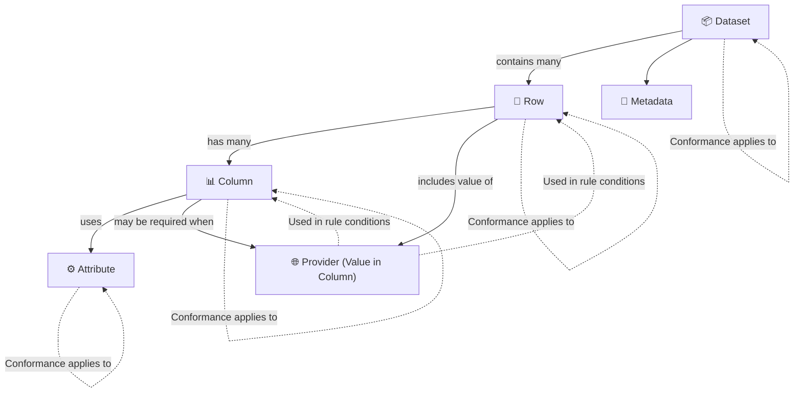

# Extracting Conformance Requirements - Stage 1

## FOCUS Core Entities
The following architectural components define the core entities in FOCUS that shape the structure and flow of billing data.

### FOCUS Architectural components

- **Dataset, Row, Column, Attribute, Metadata** are the **core structural entities** where conformance requirements are directly assigned.

- **Provider** is not a structural entity but is frequently used as a c**onditional input** to determine when a requirement applies.

- **Columns** and **Rows** can conditionally depend on the value of Provider to apply or skip certain validation logic.

### FOCUS Entity Reference Table

| Entity      | Description                        | Applies To                                | Example CR Function                                                                                      |
| ----------- | ---------------------------------- | ----------------------------------------- | -------------------------------------------------------------------------------------------------------- |
| `Dataset`   | Whole billing dataset              | Structural presence, versioning, coverage | Dataset MUST include all columns required by the declared FOCUS version                                 |
| `Row`       | Individual line item in dataset    | Logic conditions, nullability, alignment  | Rows with `ChargeCategory = Purchase` MUST contain a `SkuId`                                            |
| `Column`    | Named field across rows            | Data type, format, constraints            | Column `BillingPeriodStart` MUST be of type `DateTime`                                                  |
| `Attribute` | Shared formatting/logic constraint | Formatting consistency across columns     | All `String` columns MUST conform to `StringHandling` requirements                                      |
| `Metadata`  | Schema-level dataset descriptors   | Schema versioning, declaration            | Metadata MUST declare `focus_version` as a valid semantic version string (e.g., "1.2.0")                |
| `Provider`  | System that generated the data     | Conditional logic in requirements         | Column `CapacityReservationId` MUST be present when the provider supports capacity reservation features |