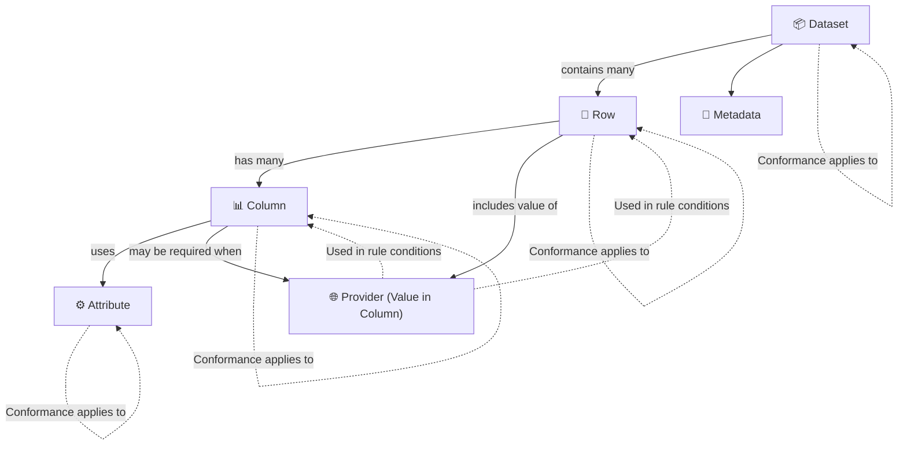

# Extracting Conformance Requirements
Conformance Requirements are structured, testable rules that define how each column in a dataset must behave in order to comply with the FOCUS specification. These rules are extracted from **verbose normative text** and translated into precise **logic statements** that can be programmatically validated. Each requirement includes elements such as _applicability conditions_, _expected behavior_, and _dependencies_ on other rules—enabling both human-readable documentation and automated conformance checking.

## Introduction

This document outlines a structured approach to converting verbose technical requirements from the FOCUS v1.2 specification into precise, programmatically testable conformance requirements. The goal is to enable consistent validation, documentation, and visualization of rules across all dataset columns using structured JSON representations.

The project is divided into three main stages, each with a defined scope and estimated effort:

### Stage 1 – Extract Conformance Requirements from FOCUS v1.2  
**Estimated Effort: 40% of total project time**

This foundational stage involves analyzing the **FOCUS v1.2** Technical Specification to extract **atomic** and **composite** conformance rules for each dataset column. These are captured in standardized Markdown tables that define logic, applicability, conditions, and dependencies.

The current output for **Stage 1** is **AI-assisted**, with over 85% of rules estimated to be valid. However, member review is critical, as the text of some requirements are complex to formalize in a prompt. The quality and accuracy of this stage directly impact the success of subsequent stages, especially JSON generation and dependency modeling.

### Stage 2 – Convert Extracted Rules into JSON Format  
**Estimated Effort: 35% of total project time**

This stage translates the structured conformance tables from **Stage 1** into a machine-readable JSON format. Each rule is converted into a defined JSON structure, validated against a shared schema. The conversion process can be largely automated by copying and adapting predefined JSON templates, which are repeated per column.

The JSON output enables programmatic validation and integration into testing workflows, making it a crucial bridge between human-readable requirements and conformance tooling.

### Stage 3 – Model Dependencies Between CRIDs  
**Estimated Effort: 25% of total project time**

This stage focuses on interpreting the `Requirement` field of each **CRID** to explicitly map dependencies to other **CRIDs** using logical structures such as `AND`, `OR`, and `NOT`. The output is used to construct a dependency graph for each column, enabling accurate validation of composite rules.

**Stage 3** can only be properly completed once both **Stage 1** and **Stage 2** are finalized, as it depends on having both accurate CRID identifiers and their JSON representations available for analysis.

These three stages form the foundation of the conformance modeling workflow. Once complete, additional outputs will be generated from the JSON representations, including:

- A standardized Markdown table of conformance requirements for each column
- A visual **DAG** _(Directed Acyclic Graph)_ diagram that maps CRID dependencies

This process enables reliable validation, clearer documentation, and easier integration with conformance tooling.

## Stage 1 - Conformance Requirements Extraction Flow – FOCUS Specification
### Flow Diagram 

### High-Level Description of Each Step:

#### 1. Target Entity – Determine the entity
Identify the target for the rule: **Dataset**, **Column**, **Attribute** property, **Provider**, etc. This sets the scope of the conformance requirement.

#### FOCUS Core Entities
The following architectural components define the core entities in FOCUS that shape the structure and flow of billing data.

**FOCUS Architectural components**

- **Dataset, Row, Column, Attribute, Metadata** are the **core structural entities** where conformance requirements are directly assigned.

- **Provider** is not a structural entity but is frequently used as a c**onditional input** to determine when a requirement applies.

- **Columns** and **Rows** can conditionally depend on the value of Provider to apply or skip certain validation logic.

**FOCUS Entity Reference Table**

| Entity      | Description                        | Applies To                                | Example CR Function                                                                                      |
| ----------- | ---------------------------------- | ----------------------------------------- | -------------------------------------------------------------------------------------------------------- |
| `Dataset`   | Whole billing dataset              | Structural presence, versioning, coverage | Dataset MUST include all columns required by the declared FOCUS version                                 |
| `Row`       | Individual line item in dataset    | Logic conditions, nullability, alignment  | Rows with `ChargeCategory = Purchase` MUST contain a `SkuId`                                            |
| `Column`    | Named field across rows            | Data type, format, constraints            | Column `BillingPeriodStart` MUST be of type `DateTime`                                                  |
| `Attribute` | Shared formatting/logic constraint | Formatting consistency across columns     | All `String` columns MUST conform to `StringHandling` requirements                                      |
| `Metadata`  | Schema-level dataset descriptors   | Schema versioning, declaration            | Metadata MUST declare `focus_version` as a valid semantic version string (e.g., "1.2.0")                |
| `Provider`  | System that generated the data     | Conditional logic in requirements         | Column `CapacityReservationId` MUST be present when the provider supports capacity reservation features |

#### 2. CRID – Apply CRID Naming Rules
Construct a unique identifier for the rule using the format:  
`{{ColumnID}}-{{EntityType}}-{{NNN}}-{{Level}}`

This ensures traceability, uniqueness, and clarity.

**Reasoning Rules**
- Use the format: `ColumnID-EntityType-NNN-Level`
- `ColumnID`: UpperCamelCase (e.g., `ListUnitPrice`)
- `EntityType:`
  - `D` = Dataset  
  - `C` = Column  
  - `A` = Attribute  
  - `P` = Provider  
  - `R` = Row  
  - `M` = Metadata
- `NNN:`  
  - `000` for root composite  
  - `0NN` for intermediate composites  
  - `001+` for single atomic rules
- `Level:`  
  - `M` = Mandatory (from MUST)  
  - `C` = Conditional (e.g., SHOULD under a condition)  
  - `O` = Optional (from MAY or unconditional SHOULD)

**Example**  
A rule states: “`ListUnitPrice` MUST conform to `NumericFormat`.”  
→ `CRID = ListUnitPrice-C-003-M`

#### 3. Function – Classify the rule type
Categorize the type of logic the rule enforces. This helps determine how it should be validated.

**Reasoning Rules**
- Use `Presence` for rules requiring the column’s inclusion in the dataset.
- Use `DataType` to enforce primitive types like `Decimal`, `String`, `Boolean`.
- Use `Format` for pattern-based constraints (e.g., `DateTimeFormat`, `UUID`, `NumericFormat`).
- Use `NullabilityRules` to define when values must or must not be null.
- Use `Validation` for business logic or fixed-value conditions not covered above.
- Use `Composite` to group multiple CRIDs with logical expressions (`AND` / `OR` / `NOT`).
- Use `Ambiguous` only when no clear classification is possible.

**Example**  
A rule states: "`BillingPeriodStart` MUST be of type `DateTime`."  
→ `Function = Format`

#### 4. Reference – Identify the reference target
Point to the human-readable column or attribute name that the rule applies to, as defined in the FOCUS specification.

**Reasoning Rules**
- Use the `display_name` for the column as written in the spec.
- For rules related to attribute-level constraints (e.g., `NumericFormat`), use the attribute name.
- This field should exactly match the title of the column or attribute from the normative requirements.

**Example**  
If the rule applies to the column `CommitmentDiscountQuantity`, set:  
→ `Reference = Commitment Discount Quantity`

#### 5. Keyword – Extract the normative keyword
Determine the obligation level using the normative keyword from the source text, such as `MUST`, `SHALL`, `SHOULD`, or `MAY`.

**Reasoning Rules**
- Identify the first normative keyword present in the requirement:
  - `MUST`, `MUST NOT` → Mandatory
  - `SHOULD`, `SHOULD NOT` → Optional (unless conditional)
  - `MAY`, `MAY NOT` → Optional
- Normalize the keyword to uppercase.
- Only one keyword should be assigned per CRItem.
- For composite rules, choose the highest obligation level from constituent CRIDs  
  (e.g., prioritize `MUST` > `SHOULD` > `MAY`).
- If `SHOULD` is used conditionally, treat the rule as `Conditional` and define the `Condition`.

**Example**  
A rule states: “Rows SHOULD include `SkuId` when `ChargeCategory = Purchase`.”  
→ `Keyword = SHOULD`

#### 6. Applicability Criteria (GATE) – Determine if the rule should be evaluated
Define the dataset-level or provider-level condition that determines when the rule is relevant for evaluation.

**Reasoning Rules**
- Use `"All_Rows"` when no structural gating is defined.
- Use a dataset-level statement (e.g., `"Dataset includes ChargeCategory column"`) for presence rules.
- Use a provider or environment condition if the rule depends on system capabilities  
  (e.g., `"Provider supports capacity reservation"`).
- For composite rules, inherit the most restrictive gating condition from child CRItems.
- Do not leave this field blank. Only omit if the applicability is inherited from a parent composite.

**Example**  
A presence rule states: “Column `CapacityReservationId` MUST be present when the provider supports capacity reservation.”  
→ `ApplicabilityCriteria = Provider supports capacity reservation`

#### 7. Condition (GATE) – Specify when to test
Define the row-level logic that determines whether the rule should be applied to a given record in the dataset.

**Reasoning Rules**
- Use `"All_Rows"` if the rule applies to every row in the dataset.
- If the rule applies conditionally, extract the condition from the normative text using simple boolean logic.

**Example patterns:**
- `ChargeCategory = "Purchase"`
- `CommitmentDiscountQuantity IS NOT NULL`

- Always express conditions in a machine-readable, testable format.
- Never leave this field empty or set to `null`.

**Example**  
A rule states: “`SkuId` MUST be present when `ChargeCategory = Purchase`.”  
→ `Condition = ChargeCategory = "Purchase"`

#### 8. MustSatisfy – Define how to test the rule
State the actual behavior or constraint being enforced by the rule in a testable format, using the original normative keyword.

**Reasoning Rules**
- Express the rule in clear, declarative language.
- Use the same keyword (`MUST`, `SHOULD`, `MAY`) as in the normative requirement.
- Keep the logic atomic — this field should describe only the rule itself, not any dependencies or logical groupings.
- Exclude conditional logic — that belongs in the `Condition` field.

**Example**  
A rule states: “`BillingPeriodStart` MUST be of type `DateTime`.”  
→ `MustSatisfy = MUST be of type DateTime`

#### 9. Requirement – Identify logical dependencies
Define whether the rule groups or depends on other CRIDs or attribute rule sets.

**Reasoning Rules**
- Use a logical expression (`AND()`, `OR()`, `NOT()`) to group CRIDs in composite rules.
- If the rule refers to a shared attribute rule set (e.g., `NumericFormat`, `StringHandling`), use:  
  `Requirement = NumericFormat:CR`
- Set to `"null"` for atomic rules that do not depend on other rules or attributes.
- Always define this field for composite rules, and make sure referenced CRIDs exist or appear later in the table.

**Example**  
A rule states: “The following rules MUST be enforced for `CommitmentDiscountQuantity` when it is not null…” and lists three CRs.  
→ `Requirement = AND(CommitmentDiscountQuantity-C-010-M, CommitmentDiscountQuantity-C-011-C, CommitmentDiscountQuantity-C-012-C)`

#### 10. Validation Type – Indicate static vs. dynamic
Specify whether the rule can be validated using only the dataset itself or if it depends on external systems or metadata.

**Reasoning Rules**
- Use `static` if the rule can be enforced by examining the dataset alone:  
  Example: value types, nullability, formatting, or schema presence.
- Use `dynamic` if validation depends on:
  - External invoice records  
  - Catalog metadata  
  - Provider configuration or billing systems
- For composite rules, set to `dynamic` if any child CRItem is dynamic.

**Example**  
A rule states: “`BillingAccountType` MUST align with the provider’s contractual agreement.”  
→ `Validation Type = dynamic`

#### 11. CRVersionIntroduced – Version tracking
Record the version of the FOCUS specification in which this rule was introduced.

**Reasoning Rules**
- For all rules generated from FOCUS v1.2, set this field to `"1.2"`.
- Do not infer or omit — this value is fixed for each release of the specification.
- This field enables forward/backward compatibility during conformance testing.

**Example**  
→ `CRVersionIntroduced = 1.2`

#### 12. Status – Set rule lifecycle status
Indicate whether the rule is `active`, `deprecated`, or `reserved` for future use.

**Reasoning Rules**
- Default to `active` unless the normative text explicitly states otherwise.
- Use `deprecated` if the rule is marked for removal or obsolescence.
- Use `reserved` if the rule is included for future development or placeholder purposes.

**Example**  
A rule marked in the spec as legacy:  
“This requirement will be removed in future versions.”  
→ `Status = deprecated`

#### 13. Notes – Capture comments
Use this field to add clarifying comments, editorial notes, or cross-references to other CRItems or attributes.

**Reasoning Rules**
- Add contextual information for better understanding of the rule.
- For attribute-based dependencies, always include a note like:  
  `Cross-attribute reference: NumericFormat:CR`
- For column-to-column dependencies, use:  
  `Cross-column reference: BillingPeriodEnd-C-001-M`
- Leave blank only when no additional clarification is needed.

**Example**  
A rule that delegates to `NumericFormat`  
→ `Notes = Cross-attribute reference: NumericFormat:CR`