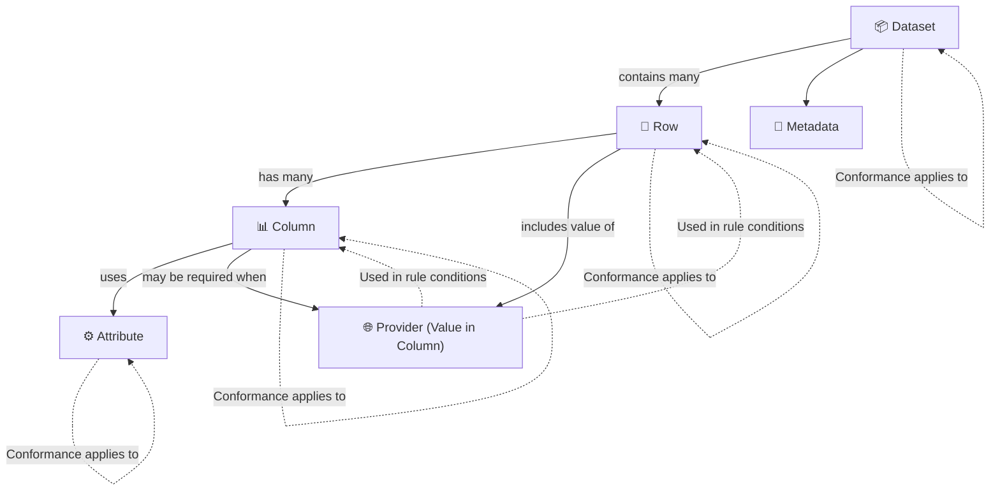

# Extracting Conformance Requirements - Stage 1

## FOCUS Core Entities
The following architectural components define the core entities in FOCUS that shape the structure and flow of billing data.

### FOCUS Architectural components

- **Dataset, Row, Column, Attribute, Metadata** are the **core structural entities** where conformance requirements are directly assigned.

- **Provider** is not a structural entity but is frequently used as a c**onditional input** to determine when a requirement applies.

- **Columns** and **Rows** can conditionally depend on the value of Provider to apply or skip certain validation logic.

### FOCUS Entity Reference Table

| Entity      | Description                        | Applies To                                | Example CR Function                                                                                      |
| ----------- | ---------------------------------- | ----------------------------------------- | -------------------------------------------------------------------------------------------------------- |
| `Dataset`   | Whole billing dataset              | Structural presence, versioning, coverage | Dataset MUST include all columns required by the declared FOCUS version                                 |
| `Row`       | Individual line item in dataset    | Logic conditions, nullability, alignment  | Rows with `ChargeCategory = Purchase` MUST contain a `SkuId`                                            |
| `Column`    | Named field across rows            | Data type, format, constraints            | Column `BillingPeriodStart` MUST be of type `DateTime`                                                  |
| `Attribute` | Shared formatting/logic constraint | Formatting consistency across columns     | All `String` columns MUST conform to `StringHandling` requirements                                      |
| `Metadata`  | Schema-level dataset descriptors   | Schema versioning, declaration            | Metadata MUST declare `focus_version` as a valid semantic version string (e.g., "1.2.0")                |
| `Provider`  | System that generated the data     | Conditional logic in requirements         | Column `CapacityReservationId` MUST be present when the provider supports capacity reservation features |

## Conformance Requirements Extraction Flow – FOCUS Specification

### High-Level Description of Each Step:

#### Target Entity – Determine the entity
Identify the target for the rule: Dataset, Column, Attribute property, Provider, etc. This sets the scope of the conformance requirement.

#### CRID – Apply CRID Naming Rules
Construct a unique identifier for the rule using the format:
{{ColumnID}}-{{ArtifactType}}-{{NNN}}-{{LEVEL}}
This ensures traceability and consistency.

#### Function – Classify the rule type
Select from one of several rule types such as `Presence`, `DataType`, `Format`, `NullabilityRules`, `Validation`, or `Composite`. Indicates whether the rule is atomic or composite.

#### Reference – Identify the reference target
Point to the relevant column or attribute that the rule applies to.

#### Keyword – Extract the normative keyword
Determine the level of obligation using normative terms such as `MUST`, `SHALL`, `SHOULD`, `MAY`, etc.

#### Applicability Criteria (GATE) – Determine if the rule should be evaluated
Specify conditions under which this rule is relevant at a metadata level (e.g., provider supports a specific feature). Helps avoid unnecessary evaluations.

#### Condition (GATE) – Specify when to test
Define the row-level or context-level condition that must be true for the rule to apply. This is critical for test selectivity.

#### MustSatisfy – Define how to test the rule
Provide test logic in a machine-readable format such as regex, numeric range, or value list to validate whether the condition is met.

#### Requirement – Identify logical dependencies
State if this rule enforces or depends on other normative requirements, helping establish rule hierarchies and dependencies.

#### Validation Type – Indicate static vs. dynamic
Declare whether the rule can be validated solely with the FOCUS dataset (`static`) or if it requires external data (`dynamic`), such as invoice records.

#### CRVersionIntroduced – Version tracking
Denote the version in which the conformance requirement was introduced. Default: **v1.2**

#### Status – Set rule lifecycle status
Indicates whether the rule is Active or Deprecated. Default: **Active**

#### Notes – Capture comments
Add clarifying information, references, or editorial remarks about the rule.