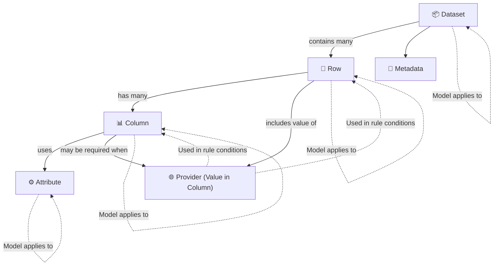

# Guidelines for writing model rules

As the FOCUS working group moves to introduce a formal rule definition structure the requirement for FOCUS members to understand how to read and write rules will increase. This guide is here to assist those who are starting their journey in writing rules for FOCUS.

The `specification/requirements_model` folder contains modular model components and a Python-based build process that assembles them into a validated `model-<version>.json` file using a corresponding JSON Schema (`model_schema.json`).

## Model document overview

The model document for FOCUS contains the following major sections:

| Section | Purpose |
|---------|---------|
| Details | Key details about the model document |
| ApplicabilityCriteria | Key flags used to define attributes about the data generator that need to be true for some model rules to apply |
| CheckFunctions | Method definitions to describe the actual check needed to conform to a rule |
| ModelDatasets | List of datasets defined by FOCUS and the related top level model rules associated with the dataset |
| ModelRules | Individual model rule definitions that are linked together by requirements and dependancies to form the full model ruleset |

## Steps to apply model rules to existing attributes and columns

An Action Item (AI) ticket should be opened to track the progress of implementing the model rules for an existing check.

### Stage 1

The first stage of conversion of rules from the normative text to model rules is for a table to be generated with the format as follows:

| ModelRuleId | Function | Reference | ApplicabilityCriteria | Condition | Requirement | Keyword | MustSatisfy | Type | Notes | ModelVersionIntroduced | Status |
|-------------------|----------|-----------|-----------------------|-----------|-------------|---------|-------------|------|-------|-----|----|
| | | | | | | | | | | | |

- `ModelRuleId` - Is the formal Id given to this entry in the model rules (See: [CR Expression Format](https://github.com/FinOps-Open-Cost-and-Usage-Spec/FOCUS_Spec/blob/1121-ai-align-on-approach-for-scrs/specification/requirements_model/README.md#-cr-expression-format))
- `Function` - The type of rule to be defined (Valid types: `Composite`, `Presence`, `Type`, `Format`, `Validation`)
- `Reference` - The Column/Attribute Id this rule applies to
- `ApplicabilityCriteria` - Specific criteria that must be true of the data generator for this rule to apply to the dataset
- `Condition` - The definition of conditions under which this rule applies
- `Requirement` - The definition of what is required for model
- `Keyword` - The Normative keyword that applies to this rule (Allowed Values: `MUST`, `RECOMMENDED`, `SHOULD`, `MAY`, `OPTIONAL`)
- `MustSatisfy` - The normative text that this rule defines
- `Type` - Identifier if this is a Static or Dynamic rule, with Static rules being possible to assess model without external information being required
- `Notes` - Free form notes (short) included in the model rule document
- `ModelVersionIntroduced` - CR Version this rule was added to the Model Rules (See: [Model Versioning](https://github.com/FinOps-Open-Cost-and-Usage-Spec/FOCUS_Spec/blob/1121-ai-align-on-approach-for-scrs/specification/requirements_model/README.md#versioning))
- `Status` - Status of the rule (Valid values: Active, Depreciated)

#### Flow Diagram

The **Flow Diagram** in Stage 1 illustrates the end-to-end process used to extract Requirements Model from the FOCUS Specification. It begins by identifying the structural or conceptual entity to which each rule applies—such as Dataset, Row, Column, Attribute, or Metadata—and then guides users through a standardized sequence of steps to assign a unique identifier, classify the rule type, determine conditional logic, and express validation criteria. This structured workflow ensures that all normative requirements from the specification are captured in a consistent, testable, and programmatically analyzable format. The diagram also reflects the relationships between FOCUS architectural components and highlights how entities like Provider influence rule applicability.


#### High-Level Description of Each Step

#### 1. Target Entity – Determine the entity

Identify the target for the rule: **Dataset**, **Column**, **Attribute** property, **Provider**, etc. This sets the scope of the model requirement.

#### FOCUS Core Entities

The following architectural components define the core entities in FOCUS that shape the structure and flow of billing data.

**FOCUS Architectural components**



- **Dataset, Row, Column, Attribute, Metadata** are the **core structural entities** where model requirements are directly assigned.

- **Provider** is not a structural entity but is frequently used as a c**onditional input** to determine when a requirement applies.

- **Columns** and **Rows** can conditionally depend on the value of Provider to apply or skip certain validation logic.

**FOCUS Entity Reference Table**

| Entity      | Description                        | Applies To                                | Example CR Function                                                                                      |
| ----------- | ---------------------------------- | ----------------------------------------- | -------------------------------------------------------------------------------------------------------- |
| `Dataset`   | Whole billing dataset              | Structural presence, versioning, coverage | Dataset MUST include all columns required by the declared FOCUS version                                 |
| `Row`       | Individual line item in dataset    | Logic conditions, nullability, alignment  | Rows with `ChargeCategory = Purchase` MUST contain a `SkuId`                                            |
| `Column`    | Named field across rows            | Data type, format, constraints            | Column `BillingPeriodStart` MUST be of type `DateTime`                                                  |
| `Attribute` | Shared formatting/logic constraint | Formatting consistency across columns     | All `String` columns MUST conform to `StringHandling` requirements                                      |
| `Metadata`  | Schema-level dataset descriptors   | Schema versioning, declaration            | Metadata MUST declare `focus_version` as a valid semantic version string (e.g., "1.2.0")                |
| `Provider`  | System that generated the data     | Conditional logic in requirements         | Column `CapacityReservationId` MUST be present when the provider supports capacity reservation features |

#### 2. CRID – Apply CRID Naming Rules

Construct a unique identifier for the rule using the format:  
`{{ColumnID}}-{{EntityType}}-{{NNN}}-{{Level}}`

This ensures traceability, uniqueness, and clarity.

**Reasoning Rules**

- Use the format: `ColumnID-EntityType-NNN-Level`
- `ColumnID`: UpperCamelCase (e.g., `ListUnitPrice`)
- `EntityType:`
  - `D` = Dataset  
  - `C` = Column  
  - `A` = Attribute  
  - `P` = Provider  
  - `R` = Row  
  - `M` = Metadata
- `NNN:`  
  - `000` for root composite  
  - `0NN` for intermediate composites  
  - `001+` for single atomic rules
- `Level:`  
  - `M` = Mandatory (from MUST)  
  - `C` = Conditional (e.g., SHOULD under a condition)  
  - `O` = Optional (from MAY or unconditional SHOULD)

**Example**  
A rule states: “`ListUnitPrice` MUST conform to `NumericFormat`.”  
→ `CRID = ListUnitPrice-C-003-M`

#### 3. Function – Classify the rule type

Categorize the type of logic the rule enforces. This helps determine how it should be validated.

**Reasoning Rules**

- Use `Presence` for rules requiring the column’s inclusion in the dataset.
- Use `DataType` to enforce primitive types like `Decimal`, `String`, `Boolean`.
- Use `Format` for pattern-based constraints (e.g., `DateTimeFormat`, `UUID`, `NumericFormat`).
- Use `NullabilityRules` to define when values must or must not be null.
- Use `Validation` for business logic or fixed-value conditions not covered above.
- Use `Composite` to group multiple CRIDs with logical expressions (`AND` / `OR` / `NOT`).
- Use `Ambiguous` only when no clear classification is possible.

**Example**  
A rule states: "`BillingPeriodStart` MUST be of type `DateTime`."  
→ `Function = Format`

#### 4. Reference – Identify the reference target

Point to the human-readable column or attribute name that the rule applies to, as defined in the FOCUS specification.

**Reasoning Rules**

- Use the `display_name` for the column as written in the spec.
- For rules related to attribute-level constraints (e.g., `NumericFormat`), use the attribute name.
- This field should exactly match the title of the column or attribute from the normative requirements.

**Example**  
If the rule applies to the column `CommitmentDiscountQuantity`, set:  
→ `Reference = Commitment Discount Quantity`

#### 5. Keyword – Extract the normative keyword

Determine the obligation level using the normative keyword from the source text, such as `MUST`, `SHALL`, `SHOULD`, or `MAY`.

**Reasoning Rules**

- Identify the first normative keyword present in the requirement:
  - `MUST`, `MUST NOT` → Mandatory
  - `SHOULD`, `SHOULD NOT` → Optional (unless conditional)
  - `MAY`, `MAY NOT` → Optional
- Normalize the keyword to uppercase.
- Only one keyword should be assigned per CRItem.
- For composite rules, choose the highest obligation level from constituent CRIDs  
  (e.g., prioritize `MUST` > `SHOULD` > `MAY`).
- If `SHOULD` is used conditionally, treat the rule as `Conditional` and define the `Condition`.

**Example**  
A rule states: “Rows SHOULD include `SkuId` when `ChargeCategory = Purchase`.”  
→ `Keyword = SHOULD`

#### 6. Applicability Criteria (GATE) – Determine if the rule should be evaluated

Define the dataset-level or provider-level condition that determines when the rule is relevant for evaluation.

**Reasoning Rules**

- Use `"All_Rows"` when no structural gating is defined.
- Use a dataset-level statement (e.g., `"Dataset includes ChargeCategory column"`) for presence rules.
- Use a provider or environment condition if the rule depends on system capabilities  
  (e.g., `"Provider supports capacity reservation"`).
- For composite rules, inherit the most restrictive gating condition from child CRItems.
- Do not leave this field blank. Only omit if the applicability is inherited from a parent composite.

**Example**  
A presence rule states: “Column `CapacityReservationId` MUST be present when the provider supports capacity reservation.”  
→ `ApplicabilityCriteria = Provider supports capacity reservation`

#### 7. Condition (GATE) – Specify when to test

Define the row-level logic that determines whether the rule should be applied to a given record in the dataset.

**Reasoning Rules**

- Use `"All_Rows"` if the rule applies to every row in the dataset.
- If the rule applies conditionally, extract the condition from the normative text using simple boolean logic.

**Example patterns:**

- `ChargeCategory = "Purchase"`
- `CommitmentDiscountQuantity IS NOT NULL`

- Always express conditions in a machine-readable, testable format.
- Never leave this field empty or set to `null`.

**Example**  
A rule states: “`SkuId` MUST be present when `ChargeCategory = Purchase`.”  
→ `Condition = ChargeCategory = "Purchase"`

#### 8. MustSatisfy – Define how to test the rule

State the actual behavior or constraint being enforced by the rule in a testable format, using the original normative keyword.

**Reasoning Rules**

- Express the rule in clear, declarative language.
- Use the same keyword (`MUST`, `SHOULD`, `MAY`) as in the normative requirement.
- Keep the logic atomic — this field should describe only the rule itself, not any dependencies or logical groupings.
- Exclude conditional logic — that belongs in the `Condition` field.

**Example**  
A rule states: “`BillingPeriodStart` MUST be of type `DateTime`.”  
→ `MustSatisfy = MUST be of type DateTime`

#### 9. Requirement – Identify logical dependencies

Define whether the rule groups or depends on other CRIDs or attribute rule sets.

**Reasoning Rules**

- Use a logical expression (`AND()`, `OR()`, `NOT()`) to group CRIDs in composite rules.
- If the rule refers to a shared attribute rule set (e.g., `NumericFormat`, `StringHandling`), use:  
  `Requirement = NumericFormat:CR`
- Set to `"null"` for atomic rules that do not depend on other rules or attributes.
- Always define this field for composite rules, and make sure referenced CRIDs exist or appear later in the table.

**Example**  
A rule states: “The following rules MUST be enforced for `CommitmentDiscountQuantity` when it is not null…” and lists three CRs.  
→ `Requirement = AND(CommitmentDiscountQuantity-C-010-M, CommitmentDiscountQuantity-C-011-C, CommitmentDiscountQuantity-C-012-C)`

#### 10. Validation Type – Indicate static vs. dynamic

Specify whether the rule can be validated using only the dataset itself or if it depends on external systems or metadata.

**Reasoning Rules**

- Use `static` if the rule can be enforced by examining the dataset alone:  
  Example: value types, nullability, formatting, or schema presence.
- Use `dynamic` if validation depends on:
  - External invoice records  
  - Catalog metadata  
  - Provider configuration or billing systems
- For composite rules, set to `dynamic` if any child CRItem is dynamic.

**Example**  
A rule states: “`BillingAccountType` MUST align with the provider’s contractual agreement.”  
→ `Validation Type = dynamic`

#### 11. ModelVersionIntroduced – Version tracking

Record the version of the FOCUS specification in which this rule was introduced.

**Reasoning Rules**

- For all rules generated from FOCUS v1.2, set this field to `"1.2"`.
- Do not infer or omit — this value is fixed for each release of the specification.
- This field enables forward/backward compatibility during conformance testing.

**Example**  
→ `ModelVersionIntroduced = 1.2`

#### 12. Status – Set rule lifecycle status

Indicate whether the rule is `active`, `deprecated`, or `reserved` for future use.

**Reasoning Rules**

- Default to `active` unless the normative text explicitly states otherwise.
- Use `deprecated` if the rule is marked for removal or obsolescence.
- Use `reserved` if the rule is included for future development or placeholder purposes.

**Example**  
A rule marked in the spec as legacy:  
“This requirement will be removed in future versions.”  
→ `Status = deprecated`

#### 13. Notes – Capture comments

Use this field to add clarifying comments, editorial notes, or cross-references to other CRItems or attributes.

**Reasoning Rules**

- Add contextual information for better understanding of the rule.
- For attribute-based dependencies, always include a note like:  
  `Cross-attribute reference: NumericFormat:CR`
- For column-to-column dependencies, use:  
  `Cross-column reference: BillingPeriodEnd-C-001-M`
- Leave blank only when no additional clarification is needed.

**Example**  
A rule that delegates to `NumericFormat`  
→ `Notes = Cross-attribute reference: NumericFormat:CR`

### Stage 2

The second phase of conversion is to take the table created in Stage 1 and create the entries in the `specification/requirements_model` folder that adds the rules to the formal JSON structure.

#### Folder structure

- `cr_details.json`: Metadata like versioning
- `applicability_criteria.json`: Feature flags controlling rule application
- `check_functions.json`: Logical validation functions and their arguments
- `model_datasets.json`: Maps datasets (e.g. FOCUS) to rule sets
- `model_rules/attributes/`: JSON files defining multiple `ModelRules` for a single attribute
- `model_rules/colunns/`: JSON files defining multiple `ModelRules` for a single column

#### Steps

- Assign the Action Item (AI) to yourself to signal that you are working on the item (See: [GitHub Issues](https://github.com/FinOps-Open-Cost-and-Usage-Spec/FOCUS_Spec/issues))
- Open a branch with the source of git branch `1121-ai-align-on-approach-for-scrs` for your development work with the naming format as follows `ai number`-cr-`entity-name`-1121. (example: 1255-cr-AvailabilityZone-1121)
- Pull your branch to your development environment and perform all work specific to this AI in this branch.
- Add a file into the relevant folder `model_rules/attributes/` or `model_rules/colunns/` with name `entity-name`.json (example: availabilityzone.json)
- Write your rules into this file based on the rules in the Stage 1 table from the AI ticket (See: [ModelRule Templates](#modelrule-templates) for helpers)
- If you need to add new ApplicabilityCriteria add them to `applicability_criteria.json` avoiding duplication
- If you need to add new CheckFunctions add them to `check_functions.json` avoiding duplication
- Add your top level model rule entry into the relevant Dataset entries in the `model_datasets.json` file
- Commit your changes to your branch and then move onto raising the PR section
If you need assistance reach out to Mike Fuller in the FOCUS slack

## Pull Request Workflow

- Navigate to Github and raise a pull request (PR) from your `ai number`-cr-`entity-name`-1121 branch to the `1121-ai-align-on-approach-for-scrs` branch
- Ensure you link the opened PR to your issue ticket by using the development cog on the right side of the PR page
- Assign the PR to `mike-finopsorg`
- Announce your PR in the [#tf-conformance-requirements](https://f2-focus.slack.com/archives/C096UTPE3NF) slack channel for other members to see
- Once reviewed and the members have had time (5 days) to add any feedback, Mike will merge the PR into the `1121-ai-align-on-approach-for-scrs` branch which will get full review when that branch is reviewed to merge into the `working_draft` branch via the PR [FR #1054: Initial commit with Model Data structure](https://github.com/FinOps-Open-Cost-and-Usage-Spec/FOCUS_Spec/pull/1209)

## ModelRule Templates

### Base column composite rule

Base rule for a column which links all related Model Rules for the column.

```json
  "SampleColumn-C-000-M": {
    "Function": "Composite",
    "Reference": "SampleColumn",
    "EntityType": "Column",
    "Notes": "",
    "ModelVersionIntroduced": "1.2",
    "Status": "Active",
    "ApplicabilityCriteria": [],
    "Type": "Static",
    "ValidationCriteria": {
      "MustSatisfy": "",
      "Keyword": "MUST",
      "Requirement": {
        "CheckFunction": "AND",
        "Items": [
          {
            "CheckFunction": "CheckModelRule",
            "ModelRuleId": "SampleColumn-C-001-M"
          },
          {
            "CheckFunction": "CheckModelRule",
            "ModelRuleId": "SampleColumn-C-002-M"
          },
          {
            "CheckFunction": "CheckModelRule",
            "ModelRuleId": "SampleColumn-C-003-M"
          }
        ]
      },
      "Condition": {},
      "Dependencies": []
    }
  }
```

### Presence requirement rule

```json
  "SampleColumn-C-001-M": {
    "Function": "Presence",
    "Reference": "SampleColumn",
    "EntityType": "Column",
    "Notes": "",
    "ModelVersionIntroduced": "1.2",
    "Status": "Active",
    "ApplicabilityCriteria": [],
    "Type": "Static",
    "ValidationCriteria": {
      "MustSatisfy": "MUST be present in a FOCUS dataset",
      "Keyword": "MUST",
      "Requirement": {
        "CheckFunction": "ColumnPresent",
        "ColumnName": "SampleColumn"
      },
      "Condition": {},
      "Dependencies": []
    }
  }
```

### NOT NULL requirement rule

Common rule for columns with a NOT NULL requirement. Can also be used when there is a NOT NULL condition.

```json
  "SampleColumn-C-002-M": {
    "Function": "Validation",
    "Reference": "SampleColumn",
    "EntityType": "Column",
    "Notes": "",
    "ModelVersionIntroduced": "1.2",
    "Status": "Active",
    "ApplicabilityCriteria": [],
    "Type": "Static",
    "ValidationCriteria": {
      "MustSatisfy": "MUST NOT be null",
      "Keyword": "MUST",
      "Requirement": {
        "CheckFunction": "CheckNotValue",
        "ColumnName": "SampleColumn",
        "Value": null
      },
      "Condition": {},
      "Dependencies": []
    }
  }
```

### Allowed Value requirement rule

Common rule for columns with a MUST be one of the allowed values requirement.

```json
  "SampleColumn-C-003-M": {
    "Function": "Validation",
    "Reference": "SampleColumn",
    "EntityType": "Column",
    "Notes": "",
    "ModelVersionIntroduced": "1.2",
    "Status": "Active",
    "ApplicabilityCriteria": [],
    "Type": "Static",
    "ValidationCriteria": {
      "MustSatisfy": "MUST be one of the allowed values",
      "Keyword": "MUST",
      "Requirement": {
        "CheckFunction": "OR",
        "Items": [
          {
            "CheckFunction": "CheckValue",
            "ColumnName": "SampleColumn",
            "Value": "AllowedValue1"
          },
          {
            "CheckFunction": "CheckValue",
            "ColumnName": "SampleColumn",
            "Value": "AllowedValue2"
          },
          {
            "CheckFunction": "CheckValue",
            "ColumnName": "SampleColumn",
            "Value": "AllowedValue3"
          }
        ]
      },
      "Condition": {},
      "Dependencies": []
    }
  }
  
### Type Decimal requirement rule

```json
  "SampleColumn-C-004-M": {
    "Function": "Type",
    "Reference": "SampleColumn",
    "EntityType": "Column",
    "Notes": "",
    "ModelVersionIntroduced": "1.2",
    "Status": "Active",
    "ApplicabilityCriteria": [],
    "Type": "Static",
    "ValidationCriteria": {
      "MustSatisfy": "MUST be of type Decimal",
      "Keyword": "MUST",
      "Requirement": {
        "CheckFunction": "TypeDecimal",
        "ColumnName": "SampleColumn"
      },
      "Condition": {},
      "Dependencies": []
    }
  }
```

### Format Numeric requirement rule

```json
  "SampleColumn-C-005-M": {
    "Function": "Format",
    "Reference": "SampleColumn",
    "EntityType": "Column",
    "Notes": "",
    "ModelVersionIntroduced": "1.2",
    "Status": "Active",
    "ApplicabilityCriteria": [],
    "Type": "Static",
    "ValidationCriteria": {
      "MustSatisfy": "MUST conform to NumericFormat requirements",
      "Keyword": "MUST",
      "Requirement": {
        "CheckFunction": "FormatNumeric",
        "ColumnName": "SampleColumn"
      },
      "Condition": {},
      "Dependencies": []
    }
  }
```

### Type String requirement rule

```json
  "SampleColumn-C-006-M": {
    "Function": "Type",
    "Reference": "SampleColumn",
    "EntityType": "Column",
    "Notes": "",
    "ModelVersionIntroduced": "1.2",
    "Status": "Active",
    "ApplicabilityCriteria": [],
    "Type": "Static",
    "ValidationCriteria": {
      "MustSatisfy": "MUST be of type String",
      "Keyword": "MUST",
      "Requirement": {
        "CheckFunction": "TypeString",
        "ColumnName": "SampleColumn"
      },
      "Condition": {},
      "Dependencies": []
    }
  }
```

### Format String Handling rule

```json
  "SampleColumn-C-007-M": {
    "Function": "Type",
    "Reference": "SampleColumn",
    "EntityType": "Column",
    "Notes": "",
    "ModelVersionIntroduced": "1.2",
    "Status": "Active",
    "ApplicabilityCriteria": [],
    "Type": "Static",
    "ValidationCriteria": {
      "MustSatisfy": "MUST conform to StringHandling requirements",
      "Keyword": "MUST",
      "Requirement": {
        "CheckFunction": "FormatString",
        "ColumnName": "SampleColumn"
      },
      "Condition": {},
      "Dependencies": []
    }
  }
```
