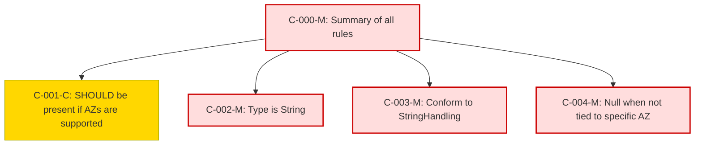

### Static Conformance Requirements – Availability Zone

 CRID                     | Function         | Reference         | Keyword  | ApplicabilityCriteria                         | MustSatisfy                                                          | Requirement                                                                                                                           | Condition                                       | Type    | CRVersionIntroduced | Status | Notes |
|--------------------------|------------------|-------------------|----------|----------------------------------------------|---------------------------------------------------------------------|---------------------------------------------------------------------------------------------------------------------------------------|------------------------------------------------|---------|----------------------|--------|-------|
| AVAILABILITYZONE-C-000-M | Composite         | Availability Zone | MUST     | All_Rows                                     | All AvailabilityZone rules MUST be enforced                          | AND(AVAILABILITYZONE-C-001-C, AVAILABILITYZONE-C-002-M, AVAILABILITYZONE-C-003-M, AVAILABILITYZONE-C-004-M)                          | ALL_ROWS                                       | static  | 1.2                  | active |       |
| AVAILABILITYZONE-C-001-C | Presence          | Availability Zone | SHOULD   | Provider supports availability zone deployment | SHOULD be present in a FOCUS dataset                                 | null                                                                                                                                | ALL_ROWS                                       | static  | 1.2                  | active |       |
| AVAILABILITYZONE-C-002-M | DataType          | Availability Zone | MUST     | All_Rows                                     | MUST be of type String                                               | null                                                                                                                                | ALL_ROWS                                       | static  | 1.2                  | active |       |
| AVAILABILITYZONE-C-003-M | Format            | Availability Zone | MUST     | All_Rows                                     | MUST conform to StringHandling requirements                          | null                                                                                                                                | ALL_ROWS                                       | static  | 1.2                  | active |       |
| AVAILABILITYZONE-C-004-M | NullabilityRules  | Availability Zone | MUST     | All_Rows                                     | MUST be null when charge is not specific to an availability zone     | null                                                                                                                                | Charge does not relate to a specific zone     | static  | 1.2                  | active |       |

### DAG of Static Conformance Requirements for `Availability Zone`

This diagram shows the logical structure and composite dependencies for the SCRs of the `Availability Zone` column in FOCUS v1.2.

| Color      | Rule Type     |
|------------|----------------|
| 🔴 `#fdd`   | Mandatory (M)  |
| 🟡 `#ffd700`| Conditional (C)|
| 🟢 `#c0f5c0`| Optional (O)   |