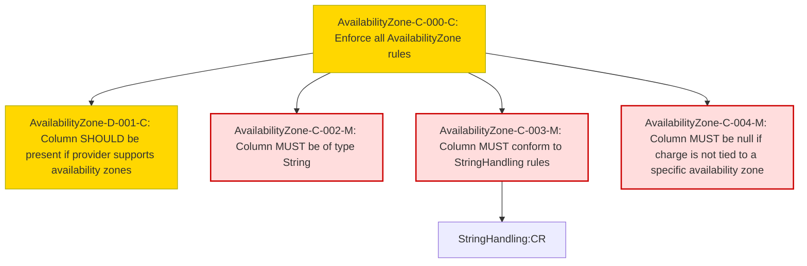

### Conformance Requirements – `Availability Zone`

| CRID                     | Function         | Reference         | Keyword     | ApplicabilityCriteria                                                       | Condition                                      | MustSatisfy                                                                                                                                              | Requirement                                                                                                 | Type   | CRVersionIntroduced | Status | Notes                                          |
| ------------------------ | ---------------- | ----------------- | ----------- | --------------------------------------------------------------------------- | ---------------------------------------------- | -------------------------------------------------------------------------------------------------------------------------------------------------------- | ----------------------------------------------------------------------------------------------------------- | ------ | ------------------- | ------ | ---------------------------------------------- |
| AvailabilityZone-C-000-C | Composite        | Availability Zone | RECOMMENDED | Provider supports deploying resources or services within availability zones | All Rows                                       | All Availability Zone rules MUST be enforced when the provider supports deploying resources or services within an availability zone.                     | AND(AvailabilityZone-D-001-C, AvailabilityZone-C-002-M, AvailabilityZone-C-003-M, AvailabilityZone-C-004-M) | static | 1.2                 | active | Most restrictive applicability is from D-001-C |
| AvailabilityZone-D-001-C | Presence         | Availability Zone | RECOMMENDED | Provider supports deploying resources or services within availability zones | All Rows                                       | AvailabilityZone is RECOMMENDED to be present in a FOCUS dataset when the provider supports deploying resources or services within an availability zone. | null                                                                                                        | static | 1.2                 | active |                                                |
| AvailabilityZone-C-002-M | DataType         | Availability Zone | MUST        | All Rows                                                                    | All Rows                                       | AvailabilityZone MUST be of type String.                                                                                                                 | null                                                                                                        | static | 1.2                 | active |                                                |
| AvailabilityZone-C-003-M | Validation       | Availability Zone | MUST        | All Rows                                                                    | All Rows                                       | AvailabilityZone MUST conform to StringHandling requirements.                                                                                            | StringHandling:CR                                                                                          | static | 1.2                 | active |                                                |
| AvailabilityZone-C-004-M | NullabilityRules | Availability Zone | MUST        | All Rows                                                                    | Charge is not specific to an availability zone | AvailabilityZone MUST be null when a charge is not specific to an availability zone.                                                                     | null                                                                                                        | static | 1.2                 | active |                                                |

### DAG of Conformance Requirements for `Availability Zone`

This diagram shows the logical structure and composite dependencies for the CRs of the `Availability Zone` column in FOCUS v1.2.

| Color      | Rule Type     |
|------------|----------------|
| 🔴 `#fdd`   | Mandatory (M)  |
| 🟡 `#ffd700`| Conditional (C)|
| 🟢 `#c0f5c0`| Optional (O)   |

