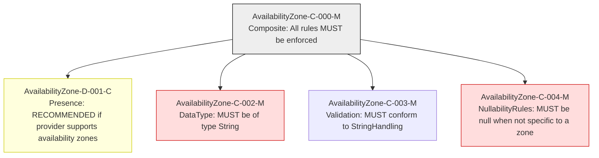

### Static Conformance Requirements – Availability Zone

| CRID                     | Function         | Reference         | Keyword     | ApplicabilityCriteria                                             | Condition                                      | MustSatisfy                                  | Requirement                                                                                                 | Type   | CRVersionIntroduced | Status | Notes                                  |
| ------------------------ | ---------------- | ----------------- | ----------- | ----------------------------------------------------------------- | ---------------------------------------------- | -------------------------------------------- | ----------------------------------------------------------------------------------------------------------- | ------ | ------------------- | ------ | -------------------------------------- |
| AvailabilityZone-C-000-C | Composite        | Availability Zone | MUST        | Provider supports deploying resources within an availability zone | All_Rows                                      | All AvailabilityZone rules MUST be enforced  | AND(AvailabilityZone-D-001-C, AvailabilityZone-C-002-M, AvailabilityZone-C-003-M, AvailabilityZone-C-004-M) | static | 1.2                 | active |                                        |
| AvailabilityZone-D-001-C | Presence         | Availability Zone | RECOMMENDED | Provider supports deploying resources within an availability zone | All_Rows                                      | RECOMMENDED to be present in a FOCUS dataset | null                                                                                                        | static | 1.2                 | active |                                        |
| AvailabilityZone-C-002-M | DataType         | Availability Zone | MUST        | All_Rows                                                         | All_Rows                                      | MUST be of type String                       | null                                                                                                        | static | 1.2                 | active |                                        |
| AvailabilityZone-C-003-M | Format           | Availability Zone | MUST        | All_Rows                                                         | All_Rows                                     | MUST conform to StringHandling               | null                                                                                                        | static | 1.2                 | active | Cross-column reference: StringHandling |
| AvailabilityZone-C-004-M | NullabilityRules | Availability Zone | MUST        | All_Rows                                                         | Charge is not specific to an availability zone | MUST be null                                 | null                                                                                                        | static | 1.2                 | active |                                        |

### DAG of Static Conformance Requirements for `Availability Zone`

This diagram shows the logical structure and composite dependencies for the SCRs of the `Availability Zone` column in FOCUS v1.2.

| Color      | Rule Type     |
|------------|----------------|
| 🔴 `#fdd`   | Mandatory (M)  |
| 🟡 `#ffd700`| Conditional (C)|
| 🟢 `#c0f5c0`| Optional (O)   |