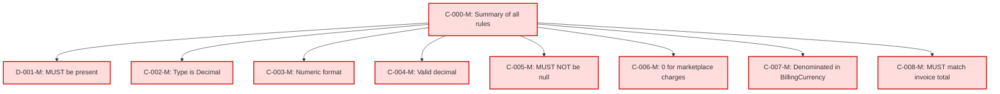

### Static Conformance Requirements – `Billed Cost`

| CRID               | Function         | Reference   | Keyword  | ApplicabilityCriteria | MustSatisfy                                                           | Requirement                                                                                                                                     | Condition                  | Type    | CRVersionIntroduced | Status | Notes                                     |
| ------------------ | ---------------- | ----------- | -------- | --------------------- | --------------------------------------------------------------------- | ----------------------------------------------------------------------------------------------------------------------------------------------- | -------------------------- | ------- | ------------------- | ------ | ----------------------------------------- |
| BILLEDCOST-C-000-M | Composite        | Billed Cost | MUST     | All_Rows              | All BilledCost rules MUST be enforced                                 | AND(BILLEDCOST-C-001-M, BILLEDCOST-C-002-M, BILLEDCOST-C-003-M, BILLEDCOST-C-004-M, BILLEDCOST-C-005-M, BILLEDCOST-C-006-M, BILLEDCOST-C-007-M) | ALL_ROWS                   | static  | 1.2                 | active |                                           |
| BILLEDCOST-D-001-M | Presence         | Billed Cost | MUST     | All_Rows              | MUST be present in a FOCUS dataset                                    | null                                                                                                                                            | ALL_ROWS                   | static  | 1.2                 | active |                                           |
| BILLEDCOST-C-002-M | DataType         | Billed Cost | MUST     | All_Rows              | MUST be of type Decimal                                               | null                                                                                                                                            | ALL_ROWS                   | static  | 1.2                 | active |                                           |
| BILLEDCOST-C-003-M | Format           | Billed Cost | MUST     | All_Rows              | MUST conform to NumericFormat                                         | null                                                                                                                                            | ALL_ROWS                   | static  | 1.2                 | active |                                           |
| BILLEDCOST-C-004-M | Validation       | Billed Cost | MUST     | All_Rows              | MUST be a valid decimal value                                         | null                                                                                                                                            | ALL_ROWS                   | static  | 1.2                 | active |                                           |
| BILLEDCOST-C-005-M | NullabilityRules | Billed Cost | MUST NOT | All_Rows              | MUST NOT be null                                                      | null                                                                                                                                            | ALL_ROWS                   | static  | 1.2                 | active |                                           |
| BILLEDCOST-C-006-M | Validation       | Billed Cost | MUST     | All_Rows              | MUST be 0 for charges where payments are received by a third party    | null                                                                                                                                            | ChargeType = "Marketplace" | static  | 1.2                 | active |                                           |
| BILLEDCOST-C-007-M | Validation       | Billed Cost | MUST     | All_Rows              | MUST be denominated in the BillingCurrency                            | null                                                                                                                                            | ALL_ROWS                   | static  | 1.2                 | active |                                           |
| BILLEDCOST-C-008-M | Validation       | Billed Cost | MUST     | All_Rows              | MUST match the sum of the payable amount on the corresponding invoice | null                                                                                                                                            | Aggregated by InvoiceId    | dynamic | 1.2                 | active | Cross-column reference: INVOICEID-C-001-M |

### DAG of Static Conformance Requirements for `Billed Cost`

This diagram shows the logical structure and composite dependencies for the SCRs of the `Billed Cost` column in FOCUS v1.2.

