### Static Conformance Requirements – `Billed Cost`

| SCRID                  | Function                              | PreCondition | Condition                                         | Requirement            | Validation Criteria                                                                                         | Notes                                                                                     | VersionIntroduced | Status  |
|------------------------|----------------------------------------|--------------|--------------------------------------------------|------------------------|-------------------------------------------------------------------------------------------------------------|-------------------------------------------------------------------------------------------|-------------------|---------|
| BILLEDCOST-C-000-M     | Summary of all applicable rules        | null         | null                                             | AND of C-001 to C-008  | MUST satisfy all applicable conformance rules from C-001 to C-008                                           |                                                                                           | 0.5               | active  |
| BILLEDCOST-C-001-M     | Define presence in dataset             | null         | null                                             | null                   | BilledCost MUST be present in a FOCUS dataset                                                               |                                                                                           | 0.5               | active  |
| BILLEDCOST-C-002-M     | Specify data type                      | null         | null                                             | null                   | BilledCost MUST be of type Decimal                                                                          |                                                                                           | 0.5               | active  |
| BILLEDCOST-C-003-M     | Ensure numeric format compliance       | null         | null                                             | null                   | BilledCost MUST conform to NumericFormat                                                                    |                                                                                           | 0.5               | active  |
| BILLEDCOST-C-004-M     | Disallow null values                   | null         | null                                             | null                   | BilledCost MUST NOT be null                                                                                 |                                                                                           | 0.5               | active  |
| BILLEDCOST-C-005-M     | Validate decimal values                | null         | BilledCost is not null                           | null                   | BilledCost MUST be a valid decimal value                                                                    |                                                                                           | 0.5               | active  |
| BILLEDCOST-C-006-C     | Require zero when paid by third party  | null         | Payment is received by a third party (e.g., marketplace) | null                   | BilledCost MUST be 0 for charges where payment is received by a third party                                |                                                                                           | 0.5               | active  |
| BILLEDCOST-C-007-M     | Ensure currency consistency            | null         | null                                             | null                   | BilledCost MUST be denominated in the BillingCurrency                                                       |                                                                                           | 0.5               | active  |
| BILLEDCOST-C-008-C     | Validate invoice sum match             | null         | InvoiceId is present for all rows in the invoice | null                   | The sum of BilledCost for a given InvoiceId MUST match the sum of the invoice payable amount               | Applies only when InvoiceId exists and mapping to invoice payable amount is possible       | 0.5               | active  |

### DAG of Static Conformance Requirements for `Billed Cost`
This diagram shows the logical structure and composite dependencies for the SCRs of the `Billed Cost` column in FOCUS v1.2.

```mermaid
graph TD

%% Root Composite
BC000["C-000-M: Summary of all applicable rules"]

%% Leaf Nodes
BC001["C-001-M: Define presence in dataset"]
BC002["C-002-M: Specify data type"]
BC003["C-003-M: Ensure numeric format compliance"]
BC004["C-004-M: Disallow null values"]
BC005["C-005-M: Validate decimal values"]
BC006["C-006-C: Require zero when paid by third party"]
BC007["C-007-M: Ensure currency consistency"]
BC008["C-008-C: Validate invoice sum match"]

%% Composite Relationships
BC000 --> BC001
BC000 --> BC002
BC000 --> BC003
BC000 --> BC004
BC000 --> BC005
BC000 --> BC006
BC000 --> BC007
BC000 --> BC008

%% Styling by Rule Type
classDef mandatory fill:#fdd,stroke:#c00,stroke-width:2px;
classDef conditional fill:#ffd700,stroke:#aa0,stroke-width:1px;
classDef optional fill:#c0f5c0,stroke:#2c8c2c,stroke-width:1px;

class BC000,BC001,BC002,BC003,BC004,BC005,BC007 mandatory;
class BC006,BC008 conditional;
```

| Color      | Rule Type     |
|------------|----------------|
| 🔴 `#fdd`   | Mandatory (M)  |
| 🟡 `#ffd700`| Conditional (C)|
| 🟢 `#c0f5c0`| Optional (O)   |