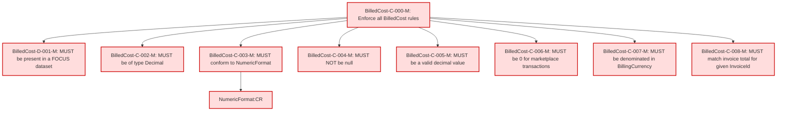

### Conformance Requirements – `Billed Cost`

| CRID               | Function         | Reference   | Keyword  | ApplicabilityCriteria | Condition                            | MustSatisfy                                                           | Requirement                                                                                                                                     | Type    | CRVersionIntroduced | Status | Notes                                     |
| ------------------ | ---------------- | ----------- | -------- | --------------------- | ------------------------------------ | --------------------------------------------------------------------- | ----------------------------------------------------------------------------------------------------------------------------------------------- | ------- | ------------------- | ------ | ----------------------------------------- |
| BilledCost-C-000-M | Composite        | Billed Cost | MUST     | Dataset includes BilledCost column | All_Rows                             | All BilledCost rules MUST be enforced                                 | AND(BilledCost-D-001-M, BilledCost-C-002-M, BilledCost-C-003-M, BilledCost-C-004-M, BilledCost-C-005-M, BilledCost-C-006-M, BilledCost-C-007-M, BilledCost-C-008-M) | static  | 1.2                 | active |                                           |
| BilledCost-D-001-M | Presence         | Billed Cost | MUST     | Dataset includes BilledCost column | All_Rows                             | MUST be present in a FOCUS dataset                                    | null                                                                                                                                             | static  | 1.2                 | active |                                           |
| BilledCost-C-002-M | DataType         | Billed Cost | MUST     | All_Rows              | All_Rows                             | MUST be of type Decimal                                               | null                                                                                                                                             | static  | 1.2                 | active |                                           |
| BilledCost-C-003-M | Format           | Billed Cost | MUST     | All_Rows              | All_Rows                             | MUST conform to NumericFormat                                         | NumericFormat:CR                                                                                                                                              | static  | 1.2                 | active | Cross-attribute reference: NumericFormat:CR |
| BilledCost-C-004-M | NullabilityRules | Billed Cost | MUST NOT | All_Rows              | All_Rows                             | MUST NOT be null                                                      | null                                                                                                                                             | static  | 1.2                 | active |                                           |
| BilledCost-C-005-M | Validation       | Billed Cost | MUST     | All_Rows              | All_Rows                             | MUST be a valid decimal value                                         | null                                                                                                                                             | static  | 1.2                 | active |                                           |
| BilledCost-C-006-M | Validation       | Billed Cost | MUST     | All_Rows              | ChargeType = "Marketplace"           | MUST be 0 for charges where payments are received by a third party    | null                                                                                                                                             | static  | 1.2                 | active |                                           |
| BilledCost-C-007-M | Validation       | Billed Cost | MUST     | All_Rows              | All_Rows                             | MUST be denominated in the BillingCurrency                            | null                                                                                                                                             | static  | 1.2                 | active | Cross-column reference: BillingCurrency-C-001-M |
| BilledCost-C-008-M | Validation       | Billed Cost | MUST     | All_Rows              | Aggregated by InvoiceId              | MUST match the sum of the payable amount on the corresponding invoice | null                                                                                                                                             | dynamic | 1.2                 | active | Cross-column reference: InvoiceId-C-001-M; Cross-column reference: InvoiceIssuer-C-001-M |

### DAG of Conformance Requirements for `Billed Cost`

This diagram shows the logical structure and composite dependencies for the CRs of the `Billed Cost` column in FOCUS v1.2.

| Color        | Rule Type       |
| ------------ | --------------- |
| 🔴 `#fdd`    | Mandatory (M)   |
| 🟡 `#ffd700` | Conditional (C) |
| 🟢 `#c0f5c0` | Optional (O)    |
