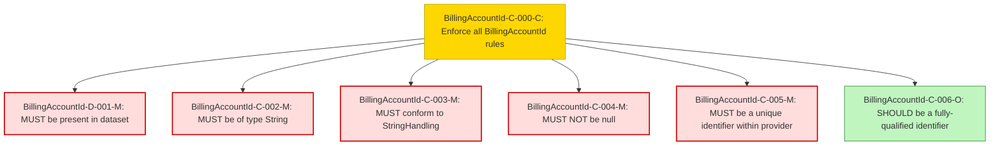

### Conformance Requirements – `Billing Account ID`

| CRID                     | Function         | Reference          | Keyword  | ApplicabilityCriteria                    | Condition | MustSatisfy                                                     | Requirement                                                                                                                                                     | Type   | CRVersionIntroduced | Status | Notes |
| ------------------------ | ---------------- | ------------------ | -------- | ---------------------------------------- | --------- | --------------------------------------------------------------- | --------------------------------------------------------------------------------------------------------------------------------------------------------------- | ------ | ------------------- | ------ | ----- |
| BillingAccountId-C-000-M | Composite        | Billing Account ID | MUST     | Dataset includes BillingAccountId column | All Rows  | All BillingAccountId rules MUST be enforced.                    | AND(BillingAccountId-D-001-M, BillingAccountId-C-002-M, BillingAccountId-C-003-M, BillingAccountId-C-004-M, BillingAccountId-C-005-M, BillingAccountId-C-006-O) | static | 1.2                 | active |       |
| BillingAccountId-D-001-M | Presence         | Billing Account ID | MUST     | Dataset includes BillingAccountId column | All Rows  | BillingAccountId MUST be present in a FOCUS dataset.            | null                                                                                                                                                            | static | 1.2                 | active |       |
| BillingAccountId-C-002-M | DataType         | Billing Account ID | MUST     | All Rows                                 | All Rows  | BillingAccountId MUST be of type String.                        | null                                                                                                                                                            | static | 1.2                 | active |       |
| BillingAccountId-C-003-M | Validation       | Billing Account ID | MUST     | All Rows                                 | All Rows  | BillingAccountId MUST conform to StringHandling requirements.   | StringHandling\:CR                                                                                                                                              | static | 1.2                 | active |       |
| BillingAccountId-C-004-M | NullabilityRules | Billing Account ID | MUST NOT | All Rows                                 | All Rows  | BillingAccountId MUST NOT be null.                              | null                                                                                                                                                            | static | 1.2                 | active |       |
| BillingAccountId-C-005-M | Validation       | Billing Account ID | MUST     | All Rows                                 | All Rows  | BillingAccountId MUST be a unique identifier within a provider. | null                                                                                                                                                            | static | 1.2                 | active |       |
| BillingAccountId-C-006-O | Validation       | Billing Account ID | SHOULD   | All Rows                                 | All Rows  | BillingAccountId SHOULD be a fully-qualified identifier.        | null                                                                                                                                                            | static | 1.2                 | active |       |

### DAG of Conformance Requirements for `Billing Account ID`
This diagram shows the logical structure and composite dependencies for the CRs of the `Billing Account ID` column in FOCUS v1.2.

| Color      | Rule Type     |
|------------|----------------|
| 🔴 `#fdd`   | Mandatory (M)  |
| 🟡 `#ffd700`| Conditional (C)|
| 🟢 `#c0f5c0`| Optional (O)   |
