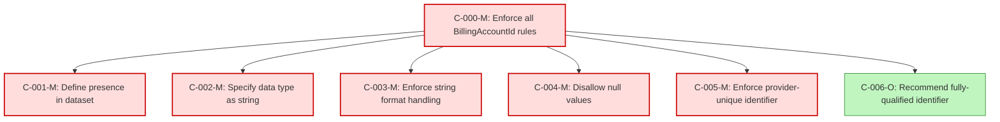

### Static Conformance Requirements – Billing Account ID

| SCRID                          | Function                            | PreCondition | Condition | Requirement                  | ValidationCriteria                                                                                   | Notes                                                                      | VersionIntroduced | Status  |
|--------------------------------|-------------------------------------|---------------|-----------|------------------------------|--------------------------------------------------------------------------------------------------------|----------------------------------------------------------------------------|-------------------|---------|
| BILLINGACCOUNTID-C-000-M       | Enforce all BillingAccountId rules  | null          | null      | AND of C-001 to C-006        | BillingAccountId MUST meet all applicable conformance rules listed from C-001 to C-006               | Composite rule for full conformance check                                 | 0.5               | active  |
| BILLINGACCOUNTID-C-001-M       | Define presence in dataset          | null          | null      | null                         | BillingAccountId MUST be present in the dataset                                                       |                                                                            | 0.5               | active  |
| BILLINGACCOUNTID-C-002-M       | Specify data type as string         | null          | null      | null                         | BillingAccountId MUST be of type String                                                               |                                                                            | 0.5               | active  |
| BILLINGACCOUNTID-C-003-M       | Enforce string format handling      | null          | null      | null                         | BillingAccountId MUST conform to FOCUS StringHandling requirements                                    |                                                                            | 0.5               | active  |
| BILLINGACCOUNTID-C-004-M       | Disallow null values                | null          | null      | null                         | BillingAccountId MUST NOT be null                                                                     |                                                                            | 0.5               | active  |
| BILLINGACCOUNTID-C-005-M       | Enforce provider-unique identifier  | null          | null      | null                         | BillingAccountId MUST be unique within the provider                                                   |                                                                            | 0.5               | active  |
| BILLINGACCOUNTID-C-006-O       | Recommend fully-qualified identifier| null          | null      | null                         | BillingAccountId SHOULD be a fully-qualified identifier                                               | Optional rule; included in composite for completeness                     | 0.5               | active  |

### DAG of Static Conformance Requirements for `Billing Account ID`
This diagram shows the logical structure and composite dependencies for the SCRs of the `Billing Account ID` column in FOCUS v1.2.

| Color      | Rule Type     |
|------------|----------------|
| 🔴 `#fdd`   | Mandatory (M)  |
| 🟡 `#ffd700`| Conditional (C)|
| 🟢 `#c0f5c0`| Optional (O)   |
