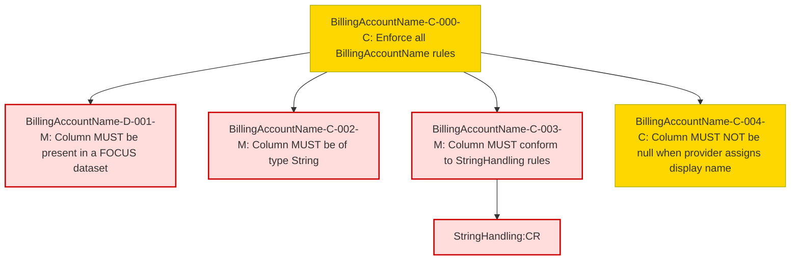

### Conformance Requirements – `Billing Account Name`

| CRID                       | Function         | Reference          | Keyword  | ApplicabilityCriteria               | Condition                                                                      | MustSatisfy                                                                                                      | Requirement                                                                                                         | Type   | CRVersionIntroduced | Status | Notes |
| -------------------------- | ---------------- | ------------------ | -------- | ----------------------------------- | ------------------------------------------------------------------------------ | ---------------------------------------------------------------------------------------------------------------- | ------------------------------------------------------------------------------------------------------------------- | ------ | ------------------- | ------ | ----- |
| BillingAccountName-C-000-M | Composite        | BillingAccountName | MUST     | All Rows                            | All Rows                                                                       | All BillingAccountName rules MUST be enforced.                                                                   | AND(BillingAccountName-D-001-M, BillingAccountName-C-002-M, BillingAccountName-C-003-M, BillingAccountName-C-004-M) | static | 1.2                 | active |       |
| BillingAccountName-D-001-M | Presence         | BillingAccountName | MUST     | Dataset includes BillingAccountName | All Rows                                                                       | BillingAccountName MUST be present in a FOCUS dataset.                                                           | null                                                                                                                | static | 1.2                 | active |       |
| BillingAccountName-C-002-M | DataType         | BillingAccountName | MUST     | All Rows                            | All Rows                                                                       | BillingAccountName MUST be of type String.                                                                       | null                                                                                                                | static | 1.2                 | active |       |
| BillingAccountName-C-003-M | Format           | BillingAccountName | MUST     | All Rows                            | All Rows                                                                       | BillingAccountName MUST conform to StringHandling requirements.                                                  | StringHandling:CR                                                                                                  | static | 1.2                 | active |       |
| BillingAccountName-C-004-M | NullabilityRules | BillingAccountName | MUST NOT | All Rows                            | BillingAccountName != null when the provider supports assigning a display name | BillingAccountName MUST NOT be null when the provider supports assigning a display name for the billing account. | null                                                                                                                | static | 1.2                 | active |       |

### DAG of Conformance Requirements for `Billing Account Name`
This diagram shows the logical structure and composite dependencies for the CRs of the `Billing Account Name` column in FOCUS v1.2.

| Color      | Rule Type     |
|------------|----------------|
| 🔴 `#fdd`   | Mandatory (M)  |
| 🟡 `#ffd700`| Conditional (C)|
| 🟢 `#c0f5c0`| Optional (O)   |

