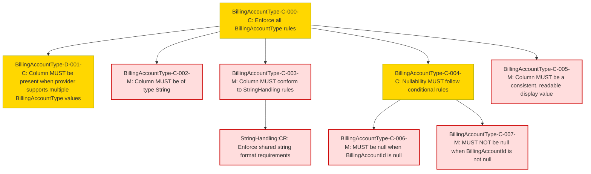

### Conformance Requirements – `Billing Account Type`

| CRID                       | Function         | Reference            | Keyword  | ApplicabilityCriteria                                             | Condition                    | MustSatisfy                                                                                                                      | Requirement                                                                                                                                     | Type   | CRVersionIntroduced | Status | Notes                                         |
| -------------------------- | ---------------- | -------------------- | -------- | ----------------------------------------------------------------- | ---------------------------- | -------------------------------------------------------------------------------------------------------------------------------- | ----------------------------------------------------------------------------------------------------------------------------------------------- | ------ | ------------------- | ------ | --------------------------------------------- |
| BillingAccountType-C-000-C | Composite        | Billing Account Type | MUST     | Provider supports more than one possible BillingAccountType value | All Rows                    | All BillingAccountType rules MUST be enforced                                                                                    | AND(BillingAccountType-D-001-C, BillingAccountType-C-002-M, BillingAccountType-C-003-M, BillingAccountType-C-004-C, BillingAccountType-C-007-M) | static | 1.2                 | active |                                               |
| BillingAccountType-D-001-C | Presence         | Billing Account Type | MUST     | Provider supports more than one possible BillingAccountType value | All Rows                    | BillingAccountType MUST be present in a FOCUS dataset when the provider supports more than one possible BillingAccountType value | null                                                                                                                                            | static | 1.2                 | active |                                               |
| BillingAccountType-C-002-M | DataType         | Billing Account Type | MUST     | Provider supports more than one possible BillingAccountType value | All Rows                    | BillingAccountType MUST be of type String                                                                                        | null                                                                                                                                            | static | 1.2                 | active |                                               |
| BillingAccountType-C-003-M | Validation       | Billing Account Type | MUST     | Provider supports more than one possible BillingAccountType value | All Rows                    | BillingAccountType MUST conform to [StringHandling](#stringhandling) requirements                                                | StringHandling:CR                                                                                                                              | static | 1.2                 | active | Cross-attribute reference: StringHandling\:CR |
| BillingAccountType-C-004-C | Composite        | Billing Account Type | MUST     | Provider supports more than one possible BillingAccountType value | All Rows                    | BillingAccountType nullability rules MUST be enforced                                                                            | AND(BillingAccountType-C-005-C, BillingAccountType-C-006-M)                                                                                     | static | 1.2                 | active |                                               |
| BillingAccountType-C-005-C | NullabilityRules | Billing Account Type | MUST     | Provider supports more than one possible BillingAccountType value | BillingAccountId is null     | BillingAccountType MUST be null when BillingAccountId is null                                                                    | null                                                                                                                                            | static | 1.2                 | active |                                               |
| BillingAccountType-C-006-M | NullabilityRules | Billing Account Type | MUST NOT | Provider supports more than one possible BillingAccountType value | BillingAccountId is not null | BillingAccountType MUST NOT be null when BillingAccountId is not null                                                            | null                                                                                                                                            | static | 1.2                 | active |                                               |
| BillingAccountType-C-007-M | Validation       | Billing Account Type | MUST     | Provider supports more than one possible BillingAccountType value | All Rows                    | BillingAccountType MUST be a consistent, readable display value                                                                  | null                                                                                                                                            | static | 1.2                 | active |                                               |

### DAG of Conformance Requirements for `Billing Account Type`
This diagram shows the logical structure and composite dependencies for the CRs of the `Billing Account Type` column in FOCUS v1.2.

| Color      | Rule Type     |
|------------|----------------|
| 🔴 `#fdd`   | Mandatory (M)  |
| 🟡 `#ffd700`| Conditional (C)|
| 🟢 `#c0f5c0`| Optional (O)   |
