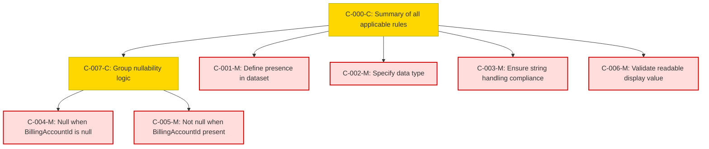

### Static Conformance Requirements – Billing Account Type

| SCRID                           | Function                                | PreCondition                            | Condition                     | Requirement                         | Validation Criteria                                                                                       | Notes                                                                                         | VersionIntroduced | Status |
|--------------------------------|-----------------------------------------|-----------------------------------------|-------------------------------|-------------------------------------|-----------------------------------------------------------------------------------------------------------|-----------------------------------------------------------------------------------------------|-------------------|--------|
| BILLINGACCOUNTTYPE-C-000-C     | Summary of all applicable rules         | SUPPORTS_MULTIPLE_BILLING_ACCOUNT_TYPES | null                          | AND(C-001, C-002, C-003, C-006, C-007) | Composite validation rule covering all conformance checks                                                 | Used to validate column behavior under full support context                                 | 1.2               | active |
| BILLINGACCOUNTTYPE-C-001-M     | Define presence in dataset              | SUPPORTS_MULTIPLE_BILLING_ACCOUNT_TYPES | null                          | null                                | BillingAccountType MUST be present in the dataset                                                        |                                                                                               | 1.2               | active |
| BILLINGACCOUNTTYPE-C-002-M     | Specify data type                       | SUPPORTS_MULTIPLE_BILLING_ACCOUNT_TYPES | null                          | null                                | BillingAccountType MUST be of type String                                                               |                                                                                               | 1.2               | active |
| BILLINGACCOUNTTYPE-C-003-M     | Ensure string handling compliance       | SUPPORTS_MULTIPLE_BILLING_ACCOUNT_TYPES | null                          | null                                | BillingAccountType MUST conform to StringHandling                                                        |                                                                                               | 1.2               | active |
| BILLINGACCOUNTTYPE-C-004-M     | Null when BillingAccountId is null      | SUPPORTS_MULTIPLE_BILLING_ACCOUNT_TYPES | BillingAccountId IS null      | null                                | BillingAccountType MUST be null when BillingAccountId is null                                            |                                                                                               | 1.2               | active |
| BILLINGACCOUNTTYPE-C-005-M     | Not null when BillingAccountId present  | SUPPORTS_MULTIPLE_BILLING_ACCOUNT_TYPES | BillingAccountId IS NOT null  | null                                | BillingAccountType MUST NOT be null when BillingAccountId is not null                                    |                                                                                               | 1.2               | active |
| BILLINGACCOUNTTYPE-C-006-M     | Validate readable display value         | SUPPORTS_MULTIPLE_BILLING_ACCOUNT_TYPES | null                          | null                                | BillingAccountType MUST be a consistent, readable display value                                          |                                                                                               | 1.2               | active |
| BILLINGACCOUNTTYPE-C-007-C     | Group nullability logic                 | SUPPORTS_MULTIPLE_BILLING_ACCOUNT_TYPES | null                          | AND(C-004, C-005)                   | BillingAccountType MUST be null when BillingAccountId is null, and MUST NOT be null otherwise            | Combines nullability paths tied to BillingAccountId                                           | 1.2               | active |

### DAG of Static Conformance Requirements for `Billing Account Type`
This diagram shows the logical structure and composite dependencies for the SCRs of the `Billing Account Type` column in FOCUS v1.2.

| Color      | Rule Type     |
|------------|----------------|
| 🔴 `#fdd`   | Mandatory (M)  |
| 🟡 `#ffd700`| Conditional (C)|
| 🟢 `#c0f5c0`| Optional (O)   |
