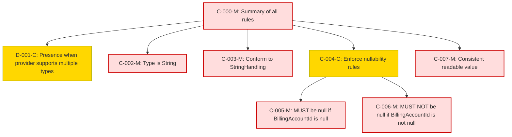

### Static Conformance Requirements – Billing Account Type

| CRID                      | Function         | Reference            | Keyword  | ApplicabilityCriteria                                             | MustSatisfy                                                                 | Requirement                                                                                                                                                        | Condition                                 | Type    | CRVersionIntroduced | Status | Notes                                     |
|---------------------------|------------------|----------------------|----------|------------------------------------------------------------------|----------------------------------------------------------------------------|------------------------------------------------------------------------------------------------------------------------------------------------------------------|-------------------------------------------|---------|---------------------|--------|-------------------------------------------|
| BILLINGACCOUNTTYPE-C-000-M | Composite        | Billing Account Type | MUST     | All_Rows                                                         | All BillingAccountType rules MUST be enforced                              | AND(BILLINGACCOUNTTYPE-D-001-C, BILLINGACCOUNTTYPE-C-002-M, BILLINGACCOUNTTYPE-C-003-M, BILLINGACCOUNTTYPE-C-004-C, BILLINGACCOUNTTYPE-C-007-M)                  | ALL_ROWS                                 | static  | 1.2                 | active |                                           |
| BILLINGACCOUNTTYPE-D-001-C | Presence         | Billing Account Type | MUST     | Provider supports multiple BillingAccountType values             | MUST be present in a FOCUS dataset                                         | null                                                                                                                                                             | Provider supports multiple values         | static  | 1.2                 | active |                                           |
| BILLINGACCOUNTTYPE-C-002-M | DataType         | Billing Account Type | MUST     | All_Rows                                                         | MUST be of type String                                                     | null                                                                                                                                                             | ALL_ROWS                                 | static  | 1.2                 | active |                                           |
| BILLINGACCOUNTTYPE-C-003-M | Validation       | Billing Account Type | MUST     | All_Rows                                                         | MUST conform to StringHandling requirements                                | null                                                                                                                                                             | ALL_ROWS                                 | static  | 1.2                 | active |                                           |
| BILLINGACCOUNTTYPE-C-004-C | Composite        | Billing Account Type | MUST     | All_Rows                                                         | Nullability rules MUST be enforced                                         | AND(BILLINGACCOUNTTYPE-C-005-M, BILLINGACCOUNTTYPE-C-006-M)                                                                                                       | ALL_ROWS                                 | static  | 1.2                 | active |                                           |
| BILLINGACCOUNTTYPE-C-005-M | NullabilityRules | Billing Account Type | MUST     | All_Rows                                                         | MUST be null when BillingAccountId is null                                 | null                                                                                                                                                             | BillingAccountId IS NULL                 | static  | 1.2                 | active | Cross-column reference: BILLINGACCOUNTID  |
| BILLINGACCOUNTTYPE-C-006-M | NullabilityRules | Billing Account Type | MUST     | All_Rows                                                         | MUST NOT be null when BillingAccountId is not null                         | null                                                                                                                                                             | BillingAccountId IS NOT NULL             | static  | 1.2                 | active | Cross-column reference: BILLINGACCOUNTID  |
| BILLINGACCOUNTTYPE-C-007-M | Validation       | Billing Account Type | MUST     | All_Rows                                                         | MUST be a consistent, readable display value                               | null                                                                                                                                                             | ALL_ROWS                                 | static  | 1.2                 | active |                                           |

### DAG of Static Conformance Requirements for `Billing Account Type`
This diagram shows the logical structure and composite dependencies for the SCRs of the `Billing Account Type` column in FOCUS v1.2.

| Color      | Rule Type     |
|------------|----------------|
| 🔴 `#fdd`   | Mandatory (M)  |
| 🟡 `#ffd700`| Conditional (C)|
| 🟢 `#c0f5c0`| Optional (O)   |
