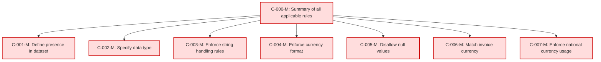

## Static Conformance Requirements - Billing Currency 
Text: [billingcurrency-v1_2.md](https://github.com/FinOps-Open-Cost-and-Usage-Spec/FOCUS_Spec/blob/v1.2/specification/columns/billingcurrency.md)

| SCRIID                  | Function                        | PreCondition | Condition | Requirement           | Validation Criteria                                                                          | Notes | VersionIntroduced | Status |
| ----------------------- | ------------------------------- | ------------ | --------- | --------------------- | -------------------------------------------------------------------------------------------- | ----- | ----------------- | ------ |
| BILLINGCURRENCY-C-000-M | Summary of all applicable rules | null         | null      | AND of C-001 to C-007 | Billing Currency MUST satisfy all conformance rules from C-001 to C-007                      |       | 0.5               | active |
| BILLINGCURRENCY-C-001-M | Define presence in dataset      | null         | null      | null                  | Billing Currency MUST be present in a FOCUS dataset                                          |       | 0.5               | active |
| BILLINGCURRENCY-C-002-M | Specify data type               | null         | null      | null                  | Billing Currency MUST be of type String                                                      |       | 0.5               | active |
| BILLINGCURRENCY-C-003-M | Enforce string handling rules   | null         | null      | null                  | Billing Currency MUST conform to StringHandling requirements                                 |       | 0.5               | active |
| BILLINGCURRENCY-C-004-M | Enforce currency format         | null         | null      | null                  | Billing Currency MUST conform to CurrencyFormat                                              |       | 0.5               | active |
| BILLINGCURRENCY-C-005-M | Disallow null values            | null         | null      | null                  | Billing Currency MUST NOT be null                                                            |       | 0.5               | active |
| BILLINGCURRENCY-C-006-M | Match invoice currency          | null         | null      | null                  | Billing Currency MUST match the currency used in the invoice generated by the invoice issuer |       | 0.5               | active |
| BILLINGCURRENCY-C-007-M | Enforce national currency usage | null         | null      | null                  | Billing Currency MUST be expressed in national currency (e.g., USD, EUR)                     |       | 0.5               | active |

### DAG of Static Conformance Requirements for `Billing Currency`

This diagram shows the logical structure and composite dependencies for the SCRs of the `Billing Currency` column in FOCUS v1.2.

| Color        | Rule Type       |
| ------------ | --------------- |
| 🔴 `#fdd`    | Mandatory (M)   |
| 🟡 `#ffd700` | Conditional (C) |
| 🟢 `#c0f5c0` | Optional (O)    |
