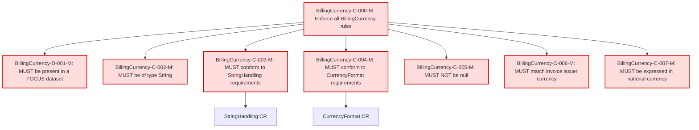

## Conformance Requirements - `Billing Currency` 

Text: [billingcurrency-v1_2.md](https://github.com/FinOps-Open-Cost-and-Usage-Spec/FOCUS_Spec/blob/v1.2/specification/columns/billingcurrency.md)

| CRID                    | Function         | Reference        | Keyword | ApplicabilityCriteria | Condition | MustSatisfy                                                                 | Requirement                                                                                                                                                                        | Type    | CRVersionIntroduced | Status | Notes                                         |
| ----------------------- | ---------------- | ---------------- | ------- | --------------------- | --------- | --------------------------------------------------------------------------- | ---------------------------------------------------------------------------------------------------------------------------------------------------------------------------------- | ------- | ------------------- | ------ | --------------------------------------------- |
| BillingCurrency-C-000-M | Composite        | Billing Currency | MUST    | Dataset includes BillingCurrency column | All_Rows | All BillingCurrency rules MUST be enforced                                  | AND(BillingCurrency-D-001-M, BillingCurrency-C-002-M, BillingCurrency-C-003-M, BillingCurrency-C-004-M, BillingCurrency-C-005-M, BillingCurrency-C-006-M, BillingCurrency-C-007-M) | static  | 1.2                 | active |                                               |
| BillingCurrency-D-001-M | Presence         | Billing Currency | MUST    | Dataset includes BillingCurrency column | All_Rows | MUST be present in a FOCUS dataset                                          | null                                                                                                                                                                               | static  | 1.2                 | active |                                               |
| BillingCurrency-C-002-M | DataType         | Billing Currency | MUST    | All_Rows             | All_Rows | MUST be of type String                                                      | null                                                                                                                                                                               | static  | 1.2                 | active |                                               |
| BillingCurrency-C-003-M | Format           | Billing Currency | MUST    | All_Rows             | All_Rows | MUST conform to StringHandling requirements                                 | StringHandling:CR                                                                                                                                                                 | static  | 1.2                 | active | Cross-attribute reference: StringHandling\:CR |
| BillingCurrency-C-004-M | Format           | Billing Currency | MUST    | All_Rows             | All_Rows | MUST conform to CurrencyFormat requirements                                 | CurrencyFormat:CR                                                                                                                                                                 | static  | 1.2                 | active | Cross-attribute reference: CurrencyFormat\:CR |
| BillingCurrency-C-005-M | NullabilityRules | Billing Currency | MUST    | All_Rows             | All_Rows | MUST NOT be null                                                            | null                                                                                                                                                                               | static  | 1.2                 | active |                                               |
| BillingCurrency-C-006-M | Validation       | Billing Currency | MUST    | All_Rows             | All_Rows | MUST match the currency used in the invoice generated by the invoice issuer | null                                                                                                                                                                               | dynamic | 1.2                 | active | Requires access to invoice metadata           |
| BillingCurrency-C-007-M | Validation       | Billing Currency | MUST    | All_Rows             | All_Rows | MUST be expressed in national currency (e.g., USD, EUR)                     | null                                                                                                                                                                               | static  | 1.2                 | active |                                |

### DAG of Conformance Requirements for `Billing Currency`

This diagram shows the logical structure and composite dependencies for the CRs of the `Billing Currency` column in FOCUS v1.2.

| Color        | Rule Type       |
| ------------ | --------------- |
| 🔴 `#fdd`    | Mandatory (M)   |
| 🟡 `#ffd700` | Conditional (C) |
| 🟢 `#c0f5c0` | Optional (O)    |
