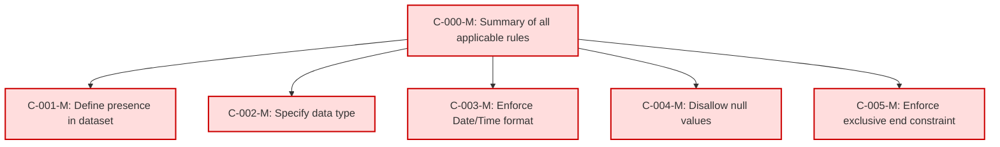

## Static Conformance Requirements – BillingPeriodEnd

These requirements define the mandatory structure and validation rules for the `BillingPeriodEnd` column in FOCUS version 1.2.

| SCRIID                    | Function                         | PreCondition | Condition | Requirement                  | Validation Criteria                                                                 | Notes | VersionIntroduced | Status |
|----------------------------|----------------------------------|---------------|-----------|-------------------------------|----------------------------------------------------------------------------------------|-------|-------------------|--------|
| BILLINGPERIODEND-C-000-M   | Summary of all applicable rules  | null          | null      | AND of C-001 to C-005         | BillingPeriodEnd MUST satisfy all conformance rules from C-001 to C-005              |       | 0.5               | active |
| BILLINGPERIODEND-C-001-M   | Define presence in dataset       | null          | null      | null                          | BillingPeriodEnd MUST be present in a FOCUS dataset                                  |       | 0.5               | active |
| BILLINGPERIODEND-C-002-M   | Specify data type                | null          | null      | null                          | BillingPeriodEnd MUST be of type Date/Time                                           |       | 0.5               | active |
| BILLINGPERIODEND-C-003-M   | Enforce Date/Time format         | null          | null      | null                          | BillingPeriodEnd MUST conform to DateTimeFormat requirements                         |       | 0.5               | active |
| BILLINGPERIODEND-C-004-M   | Disallow null values             | null          | null      | null                          | BillingPeriodEnd MUST NOT be null                                                    |       | 0.5               | active |
| BILLINGPERIODEND-C-005-M   | Enforce exclusive end constraint | null          | null      | null                          | BillingPeriodEnd MUST be the exclusive end bound of the billing period               |       | 0.5               | active |

### DAG of Static Conformance Requirements for `BillingPeriodEnd`

This diagram shows the logical structure and composite dependencies for the SCRs of the `BillingPeriodEnd` column in FOCUS v1.2.

| Color        | Rule Type       |
| ------------ | --------------- |
| 🔴 `#fdd`    | Mandatory (M)   |
| 🟡 `#ffd700` | Conditional (C) |
| 🟢 `#c0f5c0` | Optional (O)    |
