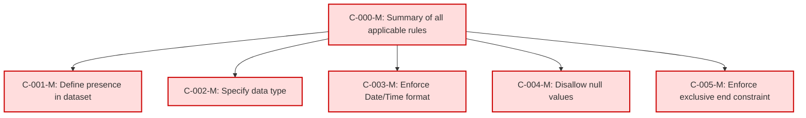

## Conformance Requirements – `Billing Period End`

These requirements define the mandatory structure and validation rules for the `Billing Period End` column in FOCUS version 1.2.

| CRID                     | Function         | Reference          | Keyword  | ApplicabilityCriteria | Condition | MustSatisfy                                           | Requirement                                                                                                                           | Type   | CRVersionIntroduced | Status | Notes                                         |
| ------------------------ | ---------------- | ------------------ | -------- | --------------------- | --------- | ----------------------------------------------------- | ------------------------------------------------------------------------------------------------------------------------------------- | ------ | ------------------- | ------ | --------------------------------------------- |
| BillingPeriodEnd-C-000-M | Composite        | Billing Period End | MUST     | Dataset includes BillingPeriodEnd column | All_Rows | All BillingPeriodEnd rules MUST be enforced           | AND(BillingPeriodEnd-D-001-M, BillingPeriodEnd-C-002-M, BillingPeriodEnd-C-003-M, BillingPeriodEnd-C-004-M, BillingPeriodEnd-C-005-M) | static | 1.2                 | active |                                               |
| BillingPeriodEnd-D-001-M | Presence         | Billing Period End | MUST     | Dataset includes BillingPeriodEnd column | All_Rows | MUST be present in a FOCUS dataset                    | null                                                                                                                                  | static | 1.2                 | active |                                               |
| BillingPeriodEnd-C-002-M | DataType         | Billing Period End | MUST     | All_Rows             | All_Rows | MUST be of type Date/Time                             | null                                                                                                                                  | static | 1.2                 | active |                                               |
| BillingPeriodEnd-C-003-M | Format           | Billing Period End | MUST     | All_Rows             | All_Rows | MUST conform to DateTimeFormat                        | DateTimeFormat:CR                                                                                                                    | static | 1.2                 | active | Cross-attribute reference: DateTimeFormat\:CR |
| BillingPeriodEnd-C-004-M | NullabilityRules | Billing Period End | MUST NOT | All_Rows             | All_Rows | MUST NOT be null                                      | null                                                                                                                                  | static | 1.2                 | active |                                               |
| BillingPeriodEnd-C-005-M | Validation       | Billing Period End | MUST     | All_Rows             | All_Rows | MUST be the exclusive end bound of the billing period | null                                                                                                                                  | static | 1.2                 | active |                                               |

### DAG of Conformance Requirements for `Billing Period End`

This diagram shows the logical structure and composite dependencies for the CRs of the `Billing Period End` column in FOCUS v1.2.

| Color        | Rule Type       |
| ------------ | --------------- |
| 🔴 `#fdd`    | Mandatory (M)   |
| 🟡 `#ffd700` | Conditional (C) |
| 🟢 `#c0f5c0` | Optional (O)    |
