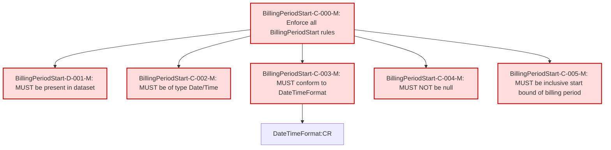

### Conformance Requirements – `BillingPeriodStart`

text: [billingperiodstart-v1_2.md](https://github.com/FinOps-Open-Cost-and-Usage-Spec/FOCUS_Spec/blob/v1.2/specification/columns/billingperiodstart.md)

These requirements define the mandatory structure and validation rules for the `Billing Period Start` column in FOCUS version 1.2.

| CRID                       | Function         | Reference            | Keyword  | ApplicabilityCriteria                      | Condition | MustSatisfy                                             | Requirement                                                                                                                                     | Type   | CRVersionIntroduced | Status | Notes                                         |
| -------------------------- | ---------------- | -------------------- | -------- | ------------------------------------------ | --------- | ------------------------------------------------------- | ----------------------------------------------------------------------------------------------------------------------------------------------- | ------ | ------------------- | ------ | --------------------------------------------- |
| BillingPeriodStart-C-000-M | Composite        | Billing Period Start | MUST     | Dataset includes BillingPeriodStart column | All_Rows | All Billing Period Start rules MUST be enforced         | AND(BillingPeriodStart-D-001-M, BillingPeriodStart-C-002-M, BillingPeriodStart-C-003-M, BillingPeriodStart-C-004-M, BillingPeriodStart-C-005-M) | static | 1.2                 | active |                                               |
| BillingPeriodStart-D-001-M | Presence         | Billing Period Start | MUST     | Dataset includes BillingPeriodStart column | All_Rows | MUST be present in a FOCUS dataset                      | null                                                                                                                                            | static | 1.2                 | active |                                               |
| BillingPeriodStart-C-002-M | DataType         | Billing Period Start | MUST     | All_Rows                                  | All_Rows | MUST be of type Date/Time                               | null                                                                                                                                            | static | 1.2                 | active |                                               |
| BillingPeriodStart-C-003-M | Format           | Billing Period Start | MUST     | All_Rows                                  | All_Rows | MUST conform to DateTimeFormat                          | DateTimeFormat\:CR                                                                                                                              | static | 1.2                 | active | Cross-attribute reference: DateTimeFormat\:CR |
| BillingPeriodStart-C-004-M | NullabilityRules | Billing Period Start | MUST NOT | All_Rows                                  | All_Rows | MUST NOT be null                                        | null                                                                                                                                            | static | 1.2                 | active |                                               |
| BillingPeriodStart-C-005-M | Validation       | Billing Period Start | MUST     | All_Rows                                  | All_Rows | MUST be the inclusive start bound of the billing period | null                                                                                                                                            | static | 1.2                 | active |                                               |

### DAG of Conformance Requirements for `Billing Period Start`

This diagram shows the logical structure and composite dependencies for the CRs of the `Billing Period Start` column in FOCUS v1.2.

| Color        | Rule Type       |
| ------------ | --------------- |
| 🔴 `#fdd`    | Mandatory (M)   |
| 🟡 `#ffd700` | Conditional (C) |
| 🟢 `#c0f5c0` | Optional (O)    |