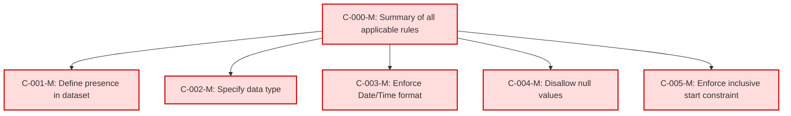

### Static Conformance Requirements – BillingPeriodStart
text: [billingperiodstart-v1_2.md](https://github.com/FinOps-Open-Cost-and-Usage-Spec/FOCUS_Spec/blob/v1.2/specification/columns/billingperiodstart.md)

These requirements define the mandatory structure and validation rules for the `BillingPeriodStart` column in FOCUS version 1.2.

| SCRIID                    | Function                           | PreCondition | Condition | Requirement                  | Validation Criteria                                                                    | Notes | VersionIntroduced | Status |
|---------------------------|------------------------------------|---------------|-----------|-------------------------------|-----------------------------------------------------------------------------------------|-------|-------------------|--------|
| BILLINGPERIODSTART-C-000-M | Summary of all applicable rules    | null          | null      | AND of C-001 to C-005         | BillingPeriodStart MUST satisfy all conformance rules from C-001 to C-005              |       | 0.5               | active |
| BILLINGPERIODSTART-C-001-M | Define presence in dataset         | null          | null      | null                          | BillingPeriodStart MUST be present in a FOCUS dataset                                  |       | 0.5               | active |
| BILLINGPERIODSTART-C-002-M | Specify data type                  | null          | null      | null                          | BillingPeriodStart MUST be of type Date/Time                                           |       | 0.5               | active |
| BILLINGPERIODSTART-C-003-M | Enforce Date/Time format           | null          | null      | null                          | BillingPeriodStart MUST conform to DateTimeFormat requirements                         |       | 0.5               | active |
| BILLINGPERIODSTART-C-004-M | Disallow null values               | null          | null      | null                          | BillingPeriodStart MUST NOT be null                                                    |       | 0.5               | active |
| BILLINGPERIODSTART-C-005-M | Enforce inclusive start constraint | null          | null      | null                          | BillingPeriodStart MUST be the inclusive start bound of the billing period             |       | 0.5               | active |

### DAG of Static Conformance Requirements for `BillingPeriodStart`

This diagram shows the logical structure and composite dependencies for the SCRs of the `BillingPeriodStart` column in FOCUS v1.2.

| Color        | Rule Type       |
| ------------ | --------------- |
| 🔴 `#fdd`    | Mandatory (M)   |
| 🟡 `#ffd700` | Conditional (C) |
| 🟢 `#c0f5c0` | Optional (O)    |