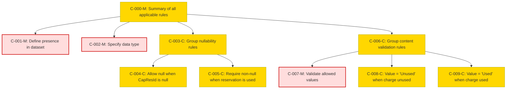

### Static Conformance Requirements – CapacityReservationID
text: [capacityreservationid-v1_2.md](https://github.com/FinOps-Open-Cost-and-Usage-Spec/FOCUS_Spec/blob/v1.2/specification/columns/capacityreservationid.md)

These requirements define the mandatory structure and validation rules for the `CapacityReservationID` column in FOCUS version 1.2.

| SCRIID                        | Function                                   | PreCondition                    | Condition                                                      | Requirement                                                                                                                                                    | Validation Criteria                                                                  | Notes                                                                                               | VersionIntroduced | Status |
| ----------------------------- | ------------------------------------------ | ------------------------------- | -------------------------------------------------------------- | -------------------------------------------------------------------------------------------------------------------------------------------------------------- | ------------------------------------------------------------------------------------ | --------------------------------------------------------------------------------------------------- | ----------------- | ------ |
| CAPACITYRESERVATIONID-C-000-M | Full conformance with required rules       | SUPPORTS\_CAPACITY\_RESERVATION | null                                                           | AND(CAPACITYRESERVATIONID-C-001-M, CAPACITYRESERVATIONID-C-002-M, CAPACITYRESERVATIONID-C-003-M, CAPACITYRESERVATIONID-C-004-C, CAPACITYRESERVATIONID-C-008-C) | MUST satisfy all applicable conformance rules for Capacity Reservation ID            | Applies only when the provider supports capacity reservations                                       | 1.1               | active |
| CAPACITYRESERVATIONID-C-001-M | Define presence in dataset                 | SUPPORTS\_CAPACITY\_RESERVATION | null                                                           | null                                                                                                                                                           | CapacityReservationId MUST be present in the dataset                                 | Precondition indicates this column only applies when the provider supports capacity reservations    | 1.1               | active |
| CAPACITYRESERVATIONID-C-002-M | Specify data type                          | SUPPORTS\_CAPACITY\_RESERVATION | null                                                           | null                                                                                                                                                           | CapacityReservationId MUST be of type String                                         |                                                                                                     | 1.1               | active |
| CAPACITYRESERVATIONID-C-003-M | Enforce StringHandling requirements        | SUPPORTS\_CAPACITY\_RESERVATION | null                                                           | null                                                                                                                                                           | CapacityReservationId MUST conform to StringHandling requirements                    |                                                                                                     | 1.1               | active |
| CAPACITYRESERVATIONID-C-004-C | Group nullability logic                    | SUPPORTS\_CAPACITY\_RESERVATION | null                                                           | OR(CAPACITYRESERVATIONID-C-006-M, CAPACITYRESERVATIONID-C-005-M, CAPACITYRESERVATIONID-C-007-O)                                                                | Enforces correct nullability based on relationship of charge to capacity reservation | Composite rule for nullability                                                                      | 1.1               | active |
| CAPACITYRESERVATIONID-C-006-M | Enforce null when unrelated to reservation | SUPPORTS\_CAPACITY\_RESERVATION | Charge is not related to a capacity reservation                | null                                                                                                                                                           | CapacityReservationId MUST be null                                                   | Implementation must define how charge-to-capacity-reservation relationships are detected.           | 1.1               | active |
| CAPACITYRESERVATIONID-C-005-M | Disallow null for unused reservation       | SUPPORTS\_CAPACITY\_RESERVATION | Charge represents the unused portion of a capacity reservation | null                                                                                                                                                           | CapacityReservationId MUST NOT be null                                               | Implementation must define how charge-to-capacity-reservation relationships are detected.           | 1.1               | active |
| CAPACITYRESERVATIONID-C-007-O | Recommend presence when related            | SUPPORTS\_CAPACITY\_RESERVATION | Charge is related to a capacity reservation                    | null                                                                                                                                                           | CapacityReservationId SHOULD NOT be null                                             | Optional guidance; best practice recommendation. Implementation must define relationship detection. | 1.1               | active |
| CAPACITYRESERVATIONID-C-008-C | Group value constraint requirements        | SUPPORTS\_CAPACITY\_RESERVATION | CapacityReservationId is not null                              | AND(CAPACITYRESERVATIONID-C-009-M, CAPACITYRESERVATIONID-C-010-O)                                                                                              | Applies constraints only when CapacityReservationId is not null                      | Composite to enforce constraints on values when present                                             | 1.1               | active |
| CAPACITYRESERVATIONID-C-009-M | Ensure uniqueness within provider          | SUPPORTS\_CAPACITY\_RESERVATION | CapacityReservationId is not null                              | null                                                                                                                                                           | CapacityReservationId MUST be a unique identifier within the provider                |                                                                                                     | 1.1               | active |
| CAPACITYRESERVATIONID-C-010-O | Recommend fully-qualified identifier       | SUPPORTS\_CAPACITY\_RESERVATION | CapacityReservationId is not null                              | null                                                                                                                                                           | CapacityReservationId SHOULD be a fully-qualified identifier                         | Best practice guidance                                                                              | 1.1               | active |

### DAG of Static Conformance Requirements for `CapacityReservationID`
This diagram shows the logical structure and composite dependencies for the SCRs of the `CapacityReservationID` column in FOCUS v1.2.

| Color      | Rule Type     |
|------------|----------------|
| 🔴 `#fdd`   | Mandatory (M)  |
| 🟡 `#ffd700`| Conditional (C)|
| 🟢 `#c0f5c0`| Optional (O)   |
