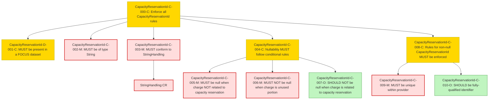

### Conformance Requirements – `Capacity Reservation ID`

text: [capacityreservationid-v1_2.md](https://github.com/FinOps-Open-Cost-and-Usage-Spec/FOCUS_Spec/blob/v1.2/specification/columns/capacityreservationid.md)

These requirements define the mandatory structure and validation rules for the `Capacity Reservation ID` column in FOCUS version 1.2.

| CRID                          | Function         | Reference               | Keyword    | ApplicabilityCriteria                   | Condition                                                | MustSatisfy                                               | Requirement                                                                                                                                                    | Type   | CRVersionIntroduced | Status | Notes                                         |
| ----------------------------- | ---------------- | ----------------------- | ---------- | --------------------------------------- | -------------------------------------------------------- | --------------------------------------------------------- | -------------------------------------------------------------------------------------------------------------------------------------------------------------- | ------ | ------------------- | ------ | --------------------------------------------- |
| CapacityReservationId-C-000-C | Composite        | Capacity Reservation ID | MUST       | Provider supports capacity reservations | All_Rows                                                | All CapacityReservationId rules MUST be enforced          | AND(CapacityReservationId-D-001-C, CapacityReservationId-C-002-M, CapacityReservationId-C-003-M, CapacityReservationId-C-004-C, CapacityReservationId-C-008-C) | static | 1.2                 | active |                                               |
| CapacityReservationId-D-001-C | Presence         | Capacity Reservation ID | MUST       | Provider supports capacity reservations | All_Rows                                                | MUST be present in a FOCUS dataset                        | null                                                                                                                                                           | static | 1.2                 | active |                                               |
| CapacityReservationId-C-002-M | DataType         | Capacity Reservation ID | MUST       | All_Rows                               | All_Rows                                                | MUST be of type String                                    | null                                                                                                                                                           | static | 1.2                 | active |                                               |
| CapacityReservationId-C-003-M | Format           | Capacity Reservation ID | MUST       | All_Rows                               | All_Rows                                                | MUST conform to StringHandling                            | StringHandling:CR                                                                                                                                             | static | 1.2                 | active | Cross-attribute reference: StringHandling\:CR |
| CapacityReservationId-C-004-C | Composite        | Capacity Reservation ID | MUST       | All_Rows                               | All_Rows                                                | Nullability MUST follow conditional rules                 | AND(CapacityReservationId-C-005-M, CapacityReservationId-C-006-M, CapacityReservationId-C-007-O)                                                               | static | 1.2                 | active |                                               |
| CapacityReservationId-C-005-M | NullabilityRules | Capacity Reservation ID | MUST       | All_Rows                               | Charge NOT related to capacity reservation               | MUST be null                                              | null                                                                                                                                                           | static | 1.2                 | active |                                               |
| CapacityReservationId-C-006-M | NullabilityRules | Capacity Reservation ID | MUST NOT   | All_Rows                               | Charge represents unused portion of capacity reservation | MUST NOT be null                                          | null                                                                                                                                                           | static | 1.2                 | active |                                               |
| CapacityReservationId-C-007-O | NullabilityRules | Capacity Reservation ID | SHOULD NOT | All_Rows                               | Charge is related to capacity reservation                | SHOULD NOT be null                                        | null                                                                                                                                                           | static | 1.2                 | active |                                               |
| CapacityReservationId-C-008-C | Composite        | Capacity Reservation ID | MUST       | All_Rows                               | CapacityReservationId IS NOT NULL                        | Rules for non-null CapacityReservationId MUST be enforced | AND(CapacityReservationId-C-009-M, CapacityReservationId-C-010-O)                                                                                              | static | 1.2                 | active |                                               |
| CapacityReservationId-C-009-M | Validation       | Capacity Reservation ID | MUST       | All_Rows                               | CapacityReservationId IS NOT NULL                        | MUST be a unique identifier within the provider           | null                                                                                                                                                           | static | 1.2                 | active |                                               |
| CapacityReservationId-C-010-O | Validation       | Capacity Reservation ID | SHOULD     | All_Rows                               | CapacityReservationId IS NOT NULL                        | SHOULD be a fully-qualified identifier                    | null                                                                                                                                                           | static | 1.2                 | active |                                               |

### DAG of Static Conformance Requirements for `Capacity Reservation ID`
This diagram shows the logical structure and composite dependencies for the CRs of the `Capacity Reservation ID` column in FOCUS v1.2.

| Color      | Rule Type     |
|------------|----------------|
| 🔴 `#fdd`   | Mandatory (M)  |
| 🟡 `#ffd700`| Conditional (C)|
| 🟢 `#c0f5c0`| Optional (O)   |
