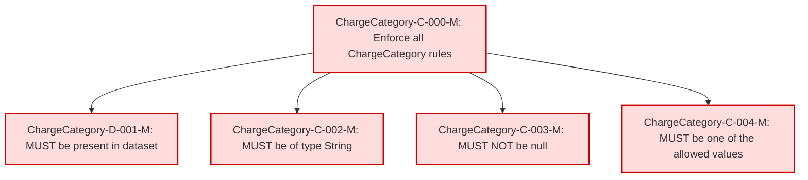

### Conformance Requirements – `Charge Category`

text: [chargecategory-v1_2.md](https://github.com/FinOps-Open-Cost-and-Usage-Spec/FOCUS_Spec/blob/v1.2/specification/columns/chargecategory.md)

These requirements define the mandatory structure and validation rules for the `Charge Category` column in FOCUS version 1.2.

| CRID                   | Function         | Reference       | Keyword  | ApplicabilityCriteria                  | Condition | MustSatisfy                                       | Requirement                                                                                         | Type   | CRVersionIntroduced | Status | Notes                                                    |
| ---------------------- | ---------------- | --------------- | -------- | -------------------------------------- | --------- | ------------------------------------------------- | --------------------------------------------------------------------------------------------------- | ------ | ------------------- | ------ | -------------------------------------------------------- |
| ChargeCategory-C-000-M | Composite        | Charge Category | MUST     | All Rows                               | All Rows  | All Charge Category rules MUST be enforced        | AND(ChargeCategory-D-001-M, ChargeCategory-C-002-M, ChargeCategory-C-003-M, ChargeCategory-C-004-M) | static | 1.2                 | active |                                                          |
| ChargeCategory-D-001-M | Presence         | Charge Category | MUST     | Dataset includes ChargeCategory column | All Rows  | ChargeCategory MUST be present in a FOCUS dataset | null                                                                                                | static | 1.2                 | active |                                                          |
| ChargeCategory-C-002-M | DataType         | Charge Category | MUST     | All Rows                               | All Rows  | ChargeCategory MUST be of type String             | null                                                                                                | static | 1.2                 | active |                                                          |
| ChargeCategory-C-003-M | NullabilityRules | Charge Category | MUST NOT | All Rows                               | All Rows  | ChargeCategory MUST NOT be null                   | null                                                                                                | static | 1.2                 | active |                                                          |
| ChargeCategory-C-004-M | Validation       | Charge Category | MUST     | All Rows                               | All Rows  | ChargeCategory MUST be one of the allowed values  | null                                                                                                | static | 1.2                 | active | Allowed values: Usage, Purchase, Tax, Credit, Adjustment |

### DAG of Conformance Requirements for `Charge Category`
This diagram shows the logical structure and composite dependencies for the CRs of the `Charge Category` column in FOCUS v1.2.

| Node Type          | Description                                                                 |
|--------------------|------------------------------|
| 🟥 Red (C-XXX-M)    | **Mandatory (M)**            |
| 🟨 Yellow (C-XXX-C) | **Conditional (C)**          |
| 🟩 Green (C-XXX-O)  | **Optional (O)**             |