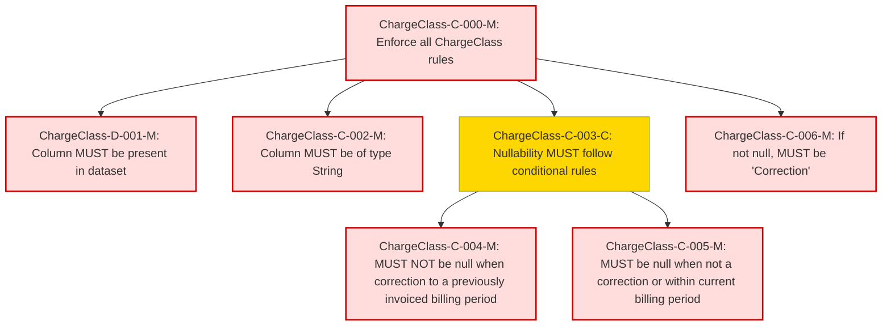

### Conformance Requirements – `Charge Class`

text: [chargeclass-v1_2.md](https://github.com/FinOps-Open-Cost-and-Usage-Spec/FOCUS_Spec/blob/v1.2/specification/columns/chargeclass.md)

These requirements define the mandatory structure and validation rules for the `Charge Class` column in FOCUS version 1.2.

| CRID                | Function         | Reference    | Keyword | ApplicabilityCriteria               | Condition                                                                                | MustSatisfy                               | Requirement                                                                             | Type   | CRVersionIntroduced | Status | Notes |
| ------------------- | ---------------- | ------------ | ------- | ----------------------------------- | ---------------------------------------------------------------------------------------- | ----------------------------------------- | --------------------------------------------------------------------------------------- | ------ | ------------------- | ------ | ----- |
| ChargeClass-C-000-M | Composite        | Charge Class | MUST    | All_Rows                           | All_Rows                                                                                | All ChargeClass rules MUST be enforced    | AND(ChargeClass-D-001-M, ChargeClass-C-002-M, ChargeClass-C-003-C, ChargeClass-C-006-M) | static | 1.2                 | active |       |
| ChargeClass-D-001-M | Presence         | Charge Class | MUST    | Dataset includes ChargeClass column | All_Rows                                                                                | MUST be present in a FOCUS dataset        | null                                                                                    | static | 1.2                 | active |       |
| ChargeClass-C-002-M | DataType         | Charge Class | MUST    | All_Rows                           | All_Rows                                                                                | MUST be of type String                    | null                                                                                    | static | 1.2                 | active |       |
| ChargeClass-C-003-C | Composite        | Charge Class | MUST    | All_Rows                           | All_Rows                                                                                | Nullability MUST follow conditional rules | AND(ChargeClass-C-004-M, ChargeClass-C-005-M)                                           | static | 1.2                 | active |       |
| ChargeClass-C-004-M | NullabilityRules | Charge Class | MUST    | All_Rows                           | Row represents correction to a previously invoiced billing period                        | MUST NOT be null                          | null                                                                                    | static | 1.2                 | active |       |
| ChargeClass-C-005-M | NullabilityRules | Charge Class | MUST    | All_Rows                           | Row does not represent correction OR represents correction within current billing period | MUST be null                              | null                                                                                    | static | 1.2                 | active |       |
| ChargeClass-C-006-M | Validation       | Charge Class | MUST    | All_Rows                           | ChargeClass IS NOT NULL                                                                  | MUST be "Correction"                      | null                                                                                    | static | 1.2                 | active |       |

### DAG of Conformance Requirements for `Charge Class`
This diagram shows the logical structure and composite dependencies for the CRs of the `Charge Class` column in FOCUS v1.2.

https://mermaid.live/

| Node Type          | Description                  |
|--------------------|------------------------------|
| 🟥 Red (C-XXX-M)    | **Mandatory (M)**            |
| 🟨 Yellow (C-XXX-C) | **Conditional (C)**          |
| 🟩 Green (C-XXX-O)  | **Optional (O)**             |
