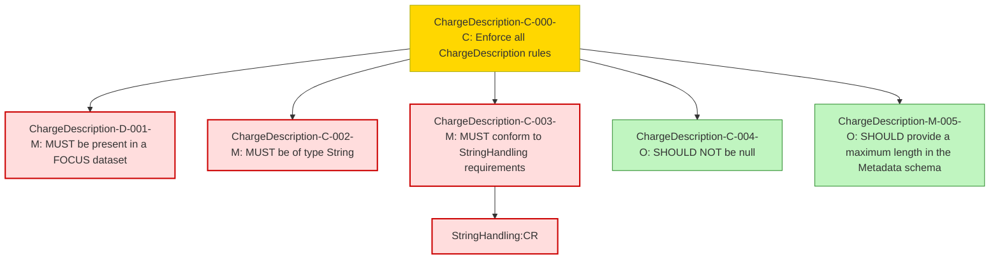

### Conformance Requirements – `Charge Description`
text: [chargedescription-v1_2.md](https://github.com/FinOps-Open-Cost-and-Usage-Spec/FOCUS_Spec/blob/v1.2/specification/columns/chargedescription.md)

These requirements define the mandatory structure and validation rules for the `Charge Description` column in FOCUS version 1.2.

| CRID                      | Function         | Reference          | Keyword    | ApplicabilityCriteria                     | Condition | MustSatisfy                                            | Requirement                                                                                                                                | Type   | CRVersionIntroduced | Status | Notes                                           |
| ------------------------- | ---------------- | ------------------ | ---------- | ----------------------------------------- | --------- | ------------------------------------------------------ | ------------------------------------------------------------------------------------------------------------------------------------------ | ------ | ------------------- | ------ | ----------------------------------------------- |
| ChargeDescription-C-000-C | Composite        | Charge Description | MUST       | All_Rows                                 | All_Rows | All ChargeDescription rules MUST be enforced           | AND(ChargeDescription-D-001-M, ChargeDescription-C-002-M, ChargeDescription-C-003-M, ChargeDescription-C-004-O, ChargeDescription-M-005-O) | static | 1.2                 | active |                                                 |
| ChargeDescription-D-001-M | Presence         | Charge Description | MUST       | Dataset includes ChargeDescription column | All_Rows | MUST be present in a FOCUS dataset                     | null                                                                                                                                       | static | 1.2                 | active |                                                 |
| ChargeDescription-C-002-M | DataType         | Charge Description | MUST       | All_Rows                                 | All_Rows | MUST be of type String                                 | null                                                                                                                                       | static | 1.2                 | active |                                                 |
| ChargeDescription-C-003-M | Format           | Charge Description | MUST       | All_Rows                                 | All_Rows | MUST conform to StringHandling requirements            | StringHandling\:CR                                                                                                                         | static | 1.2                 | active | Cross-attribute reference: StringHandling\:CR   |
| ChargeDescription-C-004-O | NullabilityRules | Charge Description | SHOULD NOT | All_Rows                                 | All_Rows | SHOULD NOT be null                                     | null                                                                                                                                       | static | 1.2                 | active |                                                 |
| ChargeDescription-M-005-O | Validation       | Charge Description | SHOULD     | All_Rows                                 | All_Rows | SHOULD provide a maximum length in the Metadata schema | null                                                                                                                                       | static | 1.2                 | active | Cross-metadata reference: FOCUS Metadata Schema |

### DAG of Conformance Requirements for `Charge Description`
This diagram shows the logical structure and composite dependencies for the CRs of the `Charge Description` column in FOCUS v1.2.

https://mermaid.live/

| Node Type          | Description                  |
|--------------------|------------------------------|
| 🟥 Red (C-XXX-M)    | **Mandatory (M)**            |
| 🟨 Yellow (C-XXX-C) | **Conditional (C)**          |
| 🟩 Green (C-XXX-O)  | **Optional (O)**             |
