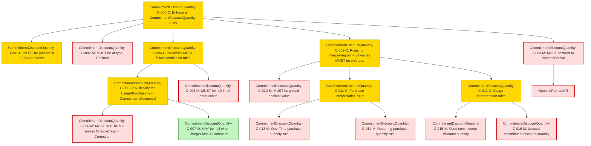

### Conformance Requirements – `Commitment Discount Quantity`
text: [commitmentdiscountquantity-v1_2.md](https://github.com/FinOps-Open-Cost-and-Usage-Spec/FOCUS_Spec/blob/v1.2/specification/columns/commitmentdiscountquantity.md)

These requirements define the mandatory structure and validation rules for the `Commitment Discount Quantity` column in FOCUS version 1.2.

| CRID                               | Function         | Reference                    | Keyword  | ApplicabilityCriteria                  | Condition                                                                                         | MustSatisfy                                                                                                                                                                                                         | Requirement                                                                                                                                                                             | Type   | CRVersionIntroduced | Status | Notes                                        |
| ---------------------------------- | ---------------- | ---------------------------- | -------- | -------------------------------------- | ------------------------------------------------------------------------------------------------- | ------------------------------------------------------------------------------------------------------------------------------------------------------------------------------------------------------------------- | --------------------------------------------------------------------------------------------------------------------------------------------------------------------------------------- | ------ | ------------------- | ------ | -------------------------------------------- |
| CommitmentDiscountQuantity-C-000-C | Composite        | Commitment Discount Quantity | MUST     | Provider supports commitment discounts | All Rows                                                                                          | All CommitmentDiscountQuantity rules MUST be enforced                                                                                                                                                               | AND(CommitmentDiscountQuantity-D-001-C, CommitmentDiscountQuantity-C-002-M, CommitmentDiscountQuantity-C-003-M, CommitmentDiscountQuantity-C-004-C, CommitmentDiscountQuantity-C-009-C) | static | 1.2                 | active |                                              |
| CommitmentDiscountQuantity-D-001-C | Presence         | Commitment Discount Quantity | MUST     | Provider supports commitment discounts | All Rows                                                                                          | CommitmentDiscountQuantity MUST be present in a FOCUS dataset when the provider supports commitment discounts                                                                                                       | null                                                                                                                                                                                    | static | 1.2                 | active |                                              |
| CommitmentDiscountQuantity-C-002-M | DataType         | Commitment Discount Quantity | MUST     | All Rows                               | All Rows                                                                                          | CommitmentDiscountQuantity MUST be of type Decimal                                                                                                                                                                  | null                                                                                                                                                                                    | static | 1.2                 | active |                                              |
| CommitmentDiscountQuantity-C-003-M | Format           | Commitment Discount Quantity | MUST     | All Rows                               | All Rows                                                                                          | CommitmentDiscountQuantity MUST conform to NumericFormat requirements                                                                                                                                               | NumericFormat\:CR                                                                                                                                                                       | static | 1.2                 | active | Cross-attribute reference: NumericFormat\:CR |
| CommitmentDiscountQuantity-C-004-C | Composite        | Commitment Discount Quantity | MUST     | All Rows                               | All Rows                                                                                          | CommitmentDiscountQuantity nullability is defined as follows:                                                                                                                                                       | AND(CommitmentDiscountQuantity-C-005-C, CommitmentDiscountQuantity-C-008-C)                                                                                                             | static | 1.2                 | active |                                              |
| CommitmentDiscountQuantity-C-005-C | Composite        | Commitment Discount Quantity | MUST     | All Rows                               | ChargeCategory is "Usage" or "Purchase" and CommitmentDiscountId is not null                      | When ChargeCategory is "Usage" or "Purchase" and CommitmentDiscountId is not null, CommitmentDiscountQuantity adheres to the following additional requirements:                                                     | AND(CommitmentDiscountQuantity-C-006-C, CommitmentDiscountQuantity-C-007-C)                                                                                                             | static | 1.2                 | active |                                              |
| CommitmentDiscountQuantity-C-006-C | NullabilityRules | Commitment Discount Quantity | MUST NOT | All Rows                               | ChargeClass is not "Correction"                                                                   | CommitmentDiscountQuantity MUST NOT be null when ChargeClass is not "Correction"                                                                                                                                    | null                                                                                                                                                                                    | static | 1.2                 | active |                                              |
| CommitmentDiscountQuantity-C-007-C | NullabilityRules | Commitment Discount Quantity | MAY      | All Rows                               | ChargeClass is "Correction"                                                                       | CommitmentDiscountQuantity MAY be null when ChargeClass is "Correction"                                                                                                                                             | null                                                                                                                                                                                    | static | 1.2                 | active |                                              |
| CommitmentDiscountQuantity-C-008-C | NullabilityRules | Commitment Discount Quantity | MUST     | All Rows                               | All Rows except when ChargeCategory is "Usage" or "Purchase" and CommitmentDiscountId is not null | CommitmentDiscountQuantity MUST be null in all other cases                                                                                                                                                          | null                                                                                                                                                                                    | static | 1.2                 | active |                                              |
| CommitmentDiscountQuantity-C-009-C | Composite        | Commitment Discount Quantity | MUST     | All Rows                               | CommitmentDiscountQuantity is not null                                                            | When CommitmentDiscountQuantity is not null, CommitmentDiscountQuantity adheres to the following additional requirements:                                                                                           | AND(CommitmentDiscountQuantity-C-010-C, CommitmentDiscountQuantity-C-011-C, CommitmentDiscountQuantity-C-014-C)                                                                         | static | 1.2                 | active |                                              |
| CommitmentDiscountQuantity-C-010-C | Validation       | Commitment Discount Quantity | MUST     | All Rows                               | All Rows                                                                                          | CommitmentDiscountQuantity MUST be a valid decimal value                                                                                                                                                            | null                                                                                                                                                                                    | static | 1.2                 | active |                                              |
| CommitmentDiscountQuantity-C-011-C | Composite        | Commitment Discount Quantity | MUST     | All Rows                               | ChargeCategory is "Purchase"                                                                      | When ChargeCategory is "Purchase":                                                                                                                                                                                  | AND(CommitmentDiscountQuantity-C-012-C, CommitmentDiscountQuantity-C-013-C)                                                                                                             | static | 1.2                 | active |                                              |
| CommitmentDiscountQuantity-C-012-C | Validation       | Commitment Discount Quantity | MUST     | All Rows                               | ChargeFrequency is "One-Time"                                                                     | CommitmentDiscountQuantity MUST be the quantity of CommitmentDiscountUnit, paid fully or partially upfront, that is eligible for consumption over the commitment discount's term when ChargeFrequency is "One-Time" | null                                                                                                                                                                                    | static | 1.2                 | active |                                              |
| CommitmentDiscountQuantity-C-013-C | Validation       | Commitment Discount Quantity | MUST     | All Rows                               | ChargeFrequency is "Recurring"                                                                    | CommitmentDiscountQuantity MUST be the quantity of CommitmentDiscountUnit that is eligible for consumption for each charge period that corresponds with the purchase when ChargeFrequency is "Recurring"            | null                                                                                                                                                                                    | static | 1.2                 | active |                                              |
| CommitmentDiscountQuantity-C-014-C | Composite        | Commitment Discount Quantity | MUST     | All Rows                               | ChargeCategory is "Usage"                                                                         | When ChargeCategory is "Usage":                                                                                                                                                                                     | AND(CommitmentDiscountQuantity-C-015-C, CommitmentDiscountQuantity-C-016-C)                                                                                                             | static | 1.2                 | active |                                              |
| CommitmentDiscountQuantity-C-015-C | Validation       | Commitment Discount Quantity | MUST     | All Rows                               | CommitmentDiscountStatus is "Used"                                                                | CommitmentDiscountQuantity MUST be the metered quantity of CommitmentDiscountUnit that is consumed in a given charge period when CommitmentDiscountStatus is "Used"                                                 | null                                                                                                                                                                                    | static | 1.2                 | active |                                              |
| CommitmentDiscountQuantity-C-016-C | Validation       | Commitment Discount Quantity | MUST     | All Rows                               | CommitmentDiscountStatus is "Unused"                                                              | CommitmentDiscountQuantity MUST be the remaining, unused quantity of CommitmentDiscountUnit in a given charge period when CommitmentDiscountStatus is "Unused"                                                      | null                                                                                                                                                                                    | static | 1.2                 | active |                                              |

### DAG of Conformance Requirements for `Commitment Discount Quantity`

This diagram shows the logical structure and composite dependencies for the CRs of the `Commitment Discount Quantity` column in FOCUS v1.2.

| Color      | Rule Type     |
|------------|----------------|
| 🔴 `#fdd`   | Mandatory (M)  |
| 🟡 `#ffd700`| Conditional (C)|
| 🟢 `#c0f5c0`| Optional (O)   |