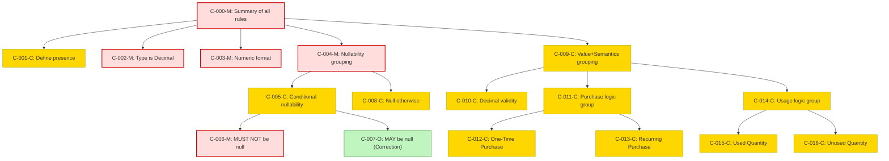

### Static Conformance Requirements – Commitment Discount Quantity

| SCRID                                | Function                               | PreCondition                   | Condition                                                                                      | Requirement                     | ValidationCriteria                                                                                         | Notes                                                                                              | VersionIntroduced | Status  |
|--------------------------------------|----------------------------------------|--------------------------------|--------------------------------------------------------------------------------------------------|----------------------------------|-------------------------------------------------------------------------------------------------------------|----------------------------------------------------------------------------------------------------|-------------------|---------|
| COMMITMENTDISCOUNTQUANTITY-C-000-M   | Summary of all applicable rules        | null                           | null                                                                                             | AND(C-001 to C-016)              | MUST satisfy all applicable conformance rules from C-001 to C-016                                         | Aggregates all rules for conformance validation                                                    | 1.1               | active  |
| COMMITMENTDISCOUNTQUANTITY-C-001-C   | Define presence in dataset             | INCLUDES_COMMITMENT_DISCOUNTS | null                                                                                             | null                             | CommitmentDiscountQuantity MUST be present in the dataset                                                 | Applies only when provider supports commitment discounts                                           | 1.1               | active  |
| COMMITMENTDISCOUNTQUANTITY-C-002-M   | Specify data type                      | null                           | null                                                                                             | null                             | CommitmentDiscountQuantity MUST be of type Decimal                                                        |                                                                                                    | 1.1               | active  |
| COMMITMENTDISCOUNTQUANTITY-C-003-M   | Ensure numeric format compliance       | null                           | null                                                                                             | null                             | CommitmentDiscountQuantity MUST conform to NumericFormat                                                  |                                                                                                    | 1.1               | active  |
| COMMITMENTDISCOUNTQUANTITY-C-004-M   | Group nullability logic (primary split)| null                           | null                                                                                             | OR(COMMITMENTDISCOUNTQUANTITY-C-005-C, COMMITMENTDISCOUNTQUANTITY-C-008-C) | null                                                                                                      | Combines valid nullability paths                                                                 | 1.1               | active  |
| COMMITMENTDISCOUNTQUANTITY-C-005-C   | Conditional nullability logic          | null                           | ChargeCategory ∈ {"Usage", "Purchase"} AND CommitmentDiscountId is not null                     | OR(COMMITMENTDISCOUNTQUANTITY-C-006-M, COMMITMENTDISCOUNTQUANTITY-C-007-O) | null                                                                                                      | Delegates to null rules based on ChargeClass                                                      | 1.1               | active  |
| COMMITMENTDISCOUNTQUANTITY-C-006-M   | Disallow null when required            | null                           | ChargeClass ≠ "Correction"                                                                       | null                             | CommitmentDiscountQuantity MUST NOT be null                                                               |                                                                                                    | 1.1               | active  |
| COMMITMENTDISCOUNTQUANTITY-C-007-O   | Allow null for correction charges      | null                           | ChargeClass = "Correction"                                                                       | null                             | CommitmentDiscountQuantity MAY be null                                                                    |                                                                                                    | 1.1               | active  |
| COMMITMENTDISCOUNTQUANTITY-C-008-C   | Disallow presence in other cases       | null                           | All other cases                                                                                   | null                             | CommitmentDiscountQuantity MUST be null                                                                   | Ensures no leakage of values outside valid context                                                | 1.1               | active  |
| COMMITMENTDISCOUNTQUANTITY-C-009-C   | Apply value and semantics if present   | null                           | ChargeCategory ∈ {"Usage", "Purchase"} AND CommitmentDiscountId is not null                      | AND(COMMITMENTDISCOUNTQUANTITY-C-010-C, COMMITMENTDISCOUNTQUANTITY-C-011-C, COMMITMENTDISCOUNTQUANTITY-C-014-C) | MUST satisfy all semantic and value conditions if value is present                                      | Composite enforcement of format + semantics                                                       | 1.1               | active  |
| COMMITMENTDISCOUNTQUANTITY-C-010-C   | Validate decimal values                | null                           | CommitmentDiscountQuantity is not null                                                           | null                             | CommitmentDiscountQuantity MUST be a valid decimal value                                                  |                                                                                                    | 1.1               | active  |
| COMMITMENTDISCOUNTQUANTITY-C-011-C   | Group purchase logic                   | null                           | ChargeCategory = "Purchase"                                                                      | OR(COMMITMENTDISCOUNTQUANTITY-C-012-C, COMMITMENTDISCOUNTQUANTITY-C-013-C) | null                                                                                                      | Split logic based on one-time vs recurring                                                        | 1.1               | active  |
| COMMITMENTDISCOUNTQUANTITY-C-012-C   | Purchase - one-time                    | null                           | ChargeFrequency = "One-Time" AND ChargeCategory = "Purchase"                                     | null                             | MUST represent quantity of CommitmentDiscountUnit eligible over the term                                 |                                                                                                    | 1.1               | active  |
| COMMITMENTDISCOUNTQUANTITY-C-013-C   | Purchase - recurring                   | null                           | ChargeFrequency = "Recurring" AND ChargeCategory = "Purchase"                                    | null                             | MUST represent quantity eligible per charge period                                                        |                                                                                                    | 1.1               | active  |
| COMMITMENTDISCOUNTQUANTITY-C-014-C   | Group usage logic                      | null                           | ChargeCategory = "Usage"                                                                         | OR(COMMITMENTDISCOUNTQUANTITY-C-015-C, COMMITMENTDISCOUNTQUANTITY-C-016-C) | null                                                                                                      | Dispatches to Used/Unused based on CommitmentDiscountStatus                                     | 1.1               | active  |
| COMMITMENTDISCOUNTQUANTITY-C-015-C   | Usage - used quantity                  | null                           | CommitmentDiscountStatus = "Used" AND ChargeCategory = "Usage"                                   | null                             | MUST represent metered quantity consumed during the charge period                                         |                                                                                                    | 1.1               | active  |
| COMMITMENTDISCOUNTQUANTITY-C-016-C   | Usage - unused quantity                | null                           | CommitmentDiscountStatus = "Unused" AND ChargeCategory = "Usage"                                 | null                             | MUST represent remaining, unused quantity during the charge period                                       |                                                                                                    | 1.1               | active  |

### DAG of Static Conformance Requirements for `CommitmentDiscountQuantity`

This diagram shows the logical structure and composite dependencies for the SCRs of the `CommitmentDiscountQuantity` column in FOCUS v1.2.

| Color      | Rule Type     |
|------------|----------------|
| 🔴 `#fdd`   | Mandatory (M)  |
| 🟡 `#ffd700`| Conditional (C)|
| 🟢 `#c0f5c0`| Optional (O)   |