### Conformance Requirements – `List Unit Price`
text: [ListUnitPrice-v1_2.md](https://github.com/FinOps-Open-Cost-and-Usage-Spec/FOCUS_Spec/blob/v1.2/specification/columns/ListUnitPrice.md)

These requirements define the mandatory structure and validation rules for the `ListUnitPrice` column in FOCUS version 1.2.

| CRID                  | Function         | Reference       | Keyword  | ApplicabilityCriteria                                 | Condition                                                                                 | MustSatisfy                                                                                                                                                                     | Requirement                                                                                                            | Type   | CRVersionIntroduced | Status | Notes                                                                                                          |
| --------------------- | ---------------- | --------------- | -------- | ----------------------------------------------------- | ----------------------------------------------------------------------------------------- | ------------------------------------------------------------------------------------------------------------------------------------------------------------------------------- | ---------------------------------------------------------------------------------------------------------------------- | ------ | ------------------- | ------ | -------------------------------------------------------------------------------------------------------------- |
| ListUnitPrice-C-000-M | Composite        | List Unit Price |          | Dataset includes ListUnitPrice column                 | All Rows                                                                                  | The ListUnitPrice column adheres to the following requirements:                                                                                                                 | AND(ListUnitPrice-D-001-C, ListUnitPrice-C-002-M, ListUnitPrice-C-003-M, ListUnitPrice-C-004-C, ListUnitPrice-C-008-C) | static | 1.2                 | active | Root composite for column-level rules                                                                          |
| ListUnitPrice-D-001-C | Presence         | List Unit Price | MUST     | Provider publishes unit prices exclusive of discounts | All Rows                                                                                  | ListUnitPrice MUST be present in a [*FOCUS dataset*](#glossary:FOCUS-dataset) when the provider publishes unit prices exclusive of discounts.                                   | null                                                                                                                   | static | 1.2                 | active |                                                                                                                |
| ListUnitPrice-C-002-M | DataType         | List Unit Price | MUST     | Dataset includes ListUnitPrice column                 | All Rows                                                                                  | ListUnitPrice MUST be of type Decimal.                                                                                                                                          | null                                                                                                                   | static | 1.2                 | active |                                                                                                                |
| ListUnitPrice-C-003-M | Format           | List Unit Price | MUST     | Dataset includes ListUnitPrice column                 | All Rows                                                                                  | ListUnitPrice MUST conform to [NumericFormat](#numericformat) requirements.                                                                                                     | NumericFormat:CR                                                                                                      | static | 1.2                 | active | Cross-attribute reference: NumericFormat                                                                       |
| ListUnitPrice-C-004-C | Composite        | List Unit Price |          | Dataset includes ListUnitPrice column                 | All Rows                                                                                  | ListUnitPrice nullability is defined as follows:                                                                                                                                | AND(ListUnitPrice-C-005-C, ListUnitPrice-C-006-C, ListUnitPrice-C-007-C)                                               | static | 1.2                 | active |                                                                                                                |
| ListUnitPrice-C-005-C | NullabilityRules | List Unit Price | MUST     | Dataset includes ListUnitPrice column                 | ChargeCategory = "Tax"                                                                    | ListUnitPrice MUST be null when [ChargeCategory](#chargecategory) is "Tax".                                                                                                     | ChargeCategory:CR                                                                                                     | static | 1.2                 | active | Cross-column reference: ChargeCategory                                                                         |
| ListUnitPrice-C-006-C | NullabilityRules | List Unit Price | MUST NOT | Dataset includes ListUnitPrice column                 | (ChargeCategory = "Usage" OR ChargeCategory = "Purchase") AND ChargeClass != "Correction" | ListUnitPrice MUST NOT be null when ChargeCategory is "Usage" or "Purchase" and [ChargeClass](#chargeclass) is not "Correction".                                                | AND(ChargeCategory:CR, ChargeClass:CR)                                                                               | static | 1.2                 | active | Cross-column reference: ChargeCategory; Cross-column reference: ChargeClass                                    |
| ListUnitPrice-C-007-C | NullabilityRules | List Unit Price | MAY      | Dataset includes ListUnitPrice column                 | All other cases                                                                           | ListUnitPrice MAY be null in all other cases.                                                                                                                                   | null                                                                                                                   | static | 1.2                 | active |                                                                                                                |
| ListUnitPrice-C-008-C | Composite        | List Unit Price |          | Dataset includes ListUnitPrice column                 | ListUnitPrice != null                                                                     | When ListUnitPrice is not null, ListUnitPrice adheres to the following additional requirements:                                                                                 | AND(ListUnitPrice-C-009-M, ListUnitPrice-C-010-M, ListUnitPrice-C-011-C, ListUnitPrice-C-012-C)                        | static | 1.2                 | active |                                                                                                                |
| ListUnitPrice-C-009-M | Validation       | List Unit Price | MUST     | Dataset includes ListUnitPrice column                 | ListUnitPrice != null                                                                     | ListUnitPrice MUST be a non-negative decimal value.                                                                                                                             | null                                                                                                                   | static | 1.2                 | active |                                                                                                                |
| ListUnitPrice-C-010-M | Validation       | List Unit Price | MUST     | Dataset includes ListUnitPrice column                 | ListUnitPrice != null                                                                     | ListUnitPrice MUST be denominated in the BillingCurrency.                                                                                                                       | BillingCurrency:CR                                                                                                    | static | 1.2                 | active | Cross-column reference: BillingCurrency                                                                        |
| ListUnitPrice-C-011-C | Validation       | List Unit Price | MUST     | Dataset includes ListUnitPrice column                 | PricingQuantity != null AND ChargeClass != "Correction"                                   | The product of ListUnitPrice and [PricingQuantity](#pricingquantity) MUST match the [ListCost](#listcost) when PricingQuantity is not null and ChargeClass is not "Correction". | AND(PricingQuantity:CR, ListCost:CR, ChargeClass:CR)                                                                | static | 1.2                 | active | Cross-column reference: ListCost; Cross-column reference: PricingQuantity; Cross-column reference: ChargeClass |
| ListUnitPrice-C-012-C | Validation       | List Unit Price | MAY      | Dataset includes ListUnitPrice column                 | ChargeClass = "Correction"                                                                | Discrepancies in ListUnitPrice, ListCost, or PricingQuantity MAY exist when ChargeClass is "Correction".                                                                        | AND(ListCost:CR, PricingQuantity:CR, ChargeClass:CR)                                                                | static | 1.2                 | active | Cross-column reference: ListCost; Cross-column reference: PricingQuantity; Cross-column reference: ChargeClass |

### DAG of Conformance Requirements for `List Unit Price`
This diagram shows the logical structure and composite dependencies for the CRs of the `List Unit Price` column in FOCUS v1.2.

https://mermaid.live/

```mermaid

graph TD

%% Root Composite
LUP000["ListUnitPrice-C-000-C: Enforce all ListUnitPrice rules"]
LUP001["ListUnitPrice-D-001-C: MUST be present in a FOCUS dataset"]
LUP002["ListUnitPrice-C-002-M: MUST be of type Decimal"]
LUP003["ListUnitPrice-C-003-M: MUST conform to NumericFormat"]
LUP004["ListUnitPrice-C-004-C: Nullability MUST follow conditional rules"]
LUP009["ListUnitPrice-C-009-C: Rules for interpreting non-null ListUnitPrice MUST be enforced"]

%% Sub-composites for nullability
LUP005["ListUnitPrice-C-005-M: MUST be null when ChargeCategory = 'Tax'"]
LUP006["ListUnitPrice-C-006-M: MUST NOT be null when ChargeCategory IN ('Usage','Purchase') and ChargeClass ≠ 'Correction'"]
LUP007["ListUnitPrice-C-007-O: MAY be null in all other cases"]

%% Sub-composites for non-null logic
LUP010["ListUnitPrice-C-010-M: MUST be a non-negative decimal value"]
LUP011["ListUnitPrice-C-011-M: MUST be denominated in the BillingCurrency"]
LUP012["ListUnitPrice-C-012-C: Product of ListUnitPrice × PricingQuantity MUST match ListCost"]
LUP013["ListUnitPrice-C-013-O: Discrepancies MAY exist when ChargeClass = 'Correction'"]

%% Edges for root composite
LUP000 --> LUP001
LUP000 --> LUP002
LUP000 --> LUP003
LUP000 --> LUP004
LUP000 --> LUP009

%% Edges for nullability composite
LUP004 --> LUP005
LUP004 --> LUP006
LUP004 --> LUP007

%% Edges for non-null composite
LUP009 --> LUP010
LUP009 --> LUP011
LUP009 --> LUP012
LUP009 --> LUP013

%% External attribute references
LUP003 --> NF["NumericFormat:CR"]

%% Styling by Rule Type
classDef mandatory fill:#fdd,stroke:#c00,stroke-width:2px;
classDef conditional fill:#ffd700,stroke:#aa0,stroke-width:1px;
classDef optional fill:#c0f5c0,stroke:#2c8c2c,stroke-width:1px;

class LUP000,LUP001,LUP004,LUP009 conditional;
class LUP002,LUP003,LUP005,LUP006,LUP010,LUP011 mandatory;
class LUP007,LUP013 optional;
class LUP012 conditional;
class NF mandatory;
```

| Node Type          | Description                  |
|--------------------|------------------------------|
| 🟥 Red (C-XXX-M)    | **Mandatory (M)**            |
| 🟨 Yellow (C-XXX-C) | **Conditional (C)**          |
| 🟩 Green (C-XXX-O)  | **Optional (O)**             |