### Conformance Requirements – `List Unit Price`
text: [ListUnitPrice-v1_2.md](https://github.com/FinOps-Open-Cost-and-Usage-Spec/FOCUS_Spec/blob/v1.2/specification/columns/ListUnitPrice.md)

These requirements define the mandatory structure and validation rules for the `ListUnitPrice` column in FOCUS version 1.2.

| CRID                  | Function         | Reference       | Keyword  | ApplicabilityCriteria                                 | Condition                                                                                | MustSatisfy                                                            | Requirement                                                                                                            | Type   | CRVersionIntroduced | Status | Notes                                        |
| --------------------- | ---------------- | --------------- | -------- | ----------------------------------------------------- | ---------------------------------------------------------------------------------------- | ---------------------------------------------------------------------- | ---------------------------------------------------------------------------------------------------------------------- | ------ | ------------------- | ------ | -------------------------------------------- |
| ListUnitPrice-C-000-C | Composite        | List Unit Price | MUST     | Provider publishes unit prices exclusive of discounts | All_Rows                                                                                | All ListUnitPrice rules MUST be enforced                               | AND(ListUnitPrice-D-001-C, ListUnitPrice-C-002-M, ListUnitPrice-C-003-M, ListUnitPrice-C-004-C, ListUnitPrice-C-009-C) | static | 1.2                 | active |                                              |
| ListUnitPrice-D-001-C | Presence         | List Unit Price | MUST     | Provider publishes unit prices exclusive of discounts | All_Rows                                                                                | MUST be present in a FOCUS dataset                                     | null                                                                                                                   | static | 1.2                 | active |                                              |
| ListUnitPrice-C-002-M | DataType         | List Unit Price | MUST     | All_Rows                                             | All_Rows                                                                                | MUST be of type Decimal                                                | null                                                                                                                   | static | 1.2                 | active |                                              |
| ListUnitPrice-C-003-M | Format           | List Unit Price | MUST     | All_Rows                                             | All_Rows                                                                                | MUST conform to NumericFormat                                          | NumericFormat:CR                                                                                                      | static | 1.2                 | active | Cross-attribute reference: NumericFormat\:CR |
| ListUnitPrice-C-004-C | Composite        | List Unit Price | MUST     | All_Rows                                             | All_Rows                                                                                | Nullability MUST follow conditional rules                              | AND(ListUnitPrice-C-005-M, ListUnitPrice-C-006-M, ListUnitPrice-C-007-O)                                               | static | 1.2                 | active |                                              |
| ListUnitPrice-C-005-M | NullabilityRules | List Unit Price | MUST     | All_Rows                                             | ChargeCategory = "Tax"                                                                   | MUST be null                                                           | null                                                                                                                   | static | 1.2                 | active |                                              |
| ListUnitPrice-C-006-M | NullabilityRules | List Unit Price | MUST NOT | All_Rows                                             | ChargeCategory IN ("Usage", "Purchase") AND ChargeClass ≠ "Correction"                   | MUST NOT be null                                                       | null                                                                                                                   | static | 1.2                 | active |                                              |
| ListUnitPrice-C-007-O | NullabilityRules | List Unit Price | MAY      | All_Rows                                             | All other cases (not matched by above conditions)                                        | MAY be null                                                            | null                                                                                                                   | static | 1.2                 | active |                                              |
| ListUnitPrice-C-009-C | Composite        | List Unit Price | MUST     | All_Rows                                             | ListUnitPrice IS NOT NULL                                                                | Rules for interpreting non-null ListUnitPrice MUST be enforced         | AND(ListUnitPrice-C-010-M, ListUnitPrice-C-011-M, ListUnitPrice-C-012-C, ListUnitPrice-C-013-O)                        | static | 1.2                 | active |                                              |
| ListUnitPrice-C-010-M | Validation       | List Unit Price | MUST     | All_Rows                                             | ListUnitPrice IS NOT NULL                                                                | MUST be a non-negative decimal value                                   | null                                                                                                                   | static | 1.2                 | active |                                              |
| ListUnitPrice-C-011-M | Validation       | List Unit Price | MUST     | All_Rows                                             | ListUnitPrice IS NOT NULL                                                                | MUST be denominated in the BillingCurrency                             | Note: Further clarification is needed.                                                                                                                   | static | 1.2                 | active |                                              |
| ListUnitPrice-C-012-C | Validation       | List Unit Price | MUST     | All_Rows                                             | PricingQuantity IS NOT NULL AND ChargeClass ≠ "Correction" AND ListUnitPrice IS NOT NULL | Product of ListUnitPrice and PricingQuantity MUST match ListCost       | null                                                                                                                   | static | 1.2                 | active |                                              |
| ListUnitPrice-C-013-O | Validation       | List Unit Price | MAY      | All_Rows                                             | ChargeClass = "Correction"                                                               | Discrepancies in ListUnitPrice, ListCost, or PricingQuantity MAY exist | null                                                                                                                   | static | 1.2                 | active |                                              |

### DAG of Conformance Requirements for `List Unit Price`
This diagram shows the logical structure and composite dependencies for the CRs of the `List Unit Price` column in FOCUS v1.2.

https://mermaid.live/

```mermaid

graph TD

%% Root Composite
LUP000["ListUnitPrice-C-000-C: Enforce all ListUnitPrice rules"]
LUP001["ListUnitPrice-D-001-C: MUST be present in a FOCUS dataset"]
LUP002["ListUnitPrice-C-002-M: MUST be of type Decimal"]
LUP003["ListUnitPrice-C-003-M: MUST conform to NumericFormat"]
LUP004["ListUnitPrice-C-004-C: Nullability MUST follow conditional rules"]
LUP009["ListUnitPrice-C-009-C: Rules for interpreting non-null ListUnitPrice MUST be enforced"]

%% Sub-composites for nullability
LUP005["ListUnitPrice-C-005-M: MUST be null when ChargeCategory = 'Tax'"]
LUP006["ListUnitPrice-C-006-M: MUST NOT be null when ChargeCategory IN ('Usage','Purchase') and ChargeClass ≠ 'Correction'"]
LUP007["ListUnitPrice-C-007-O: MAY be null in all other cases"]

%% Sub-composites for non-null logic
LUP010["ListUnitPrice-C-010-M: MUST be a non-negative decimal value"]
LUP011["ListUnitPrice-C-011-M: MUST be denominated in the BillingCurrency"]
LUP012["ListUnitPrice-C-012-C: Product of ListUnitPrice × PricingQuantity MUST match ListCost"]
LUP013["ListUnitPrice-C-013-O: Discrepancies MAY exist when ChargeClass = 'Correction'"]

%% Edges for root composite
LUP000 --> LUP001
LUP000 --> LUP002
LUP000 --> LUP003
LUP000 --> LUP004
LUP000 --> LUP009

%% Edges for nullability composite
LUP004 --> LUP005
LUP004 --> LUP006
LUP004 --> LUP007

%% Edges for non-null composite
LUP009 --> LUP010
LUP009 --> LUP011
LUP009 --> LUP012
LUP009 --> LUP013

%% External attribute references
LUP003 --> NF["NumericFormat:CR"]

%% Styling by Rule Type
classDef mandatory fill:#fdd,stroke:#c00,stroke-width:2px;
classDef conditional fill:#ffd700,stroke:#aa0,stroke-width:1px;
classDef optional fill:#c0f5c0,stroke:#2c8c2c,stroke-width:1px;

class LUP000,LUP001,LUP004,LUP009 conditional;
class LUP002,LUP003,LUP005,LUP006,LUP010,LUP011 mandatory;
class LUP007,LUP013 optional;
class LUP012 conditional;
class NF mandatory;
```

| Node Type          | Description                  |
|--------------------|------------------------------|
| 🟥 Red (C-XXX-M)    | **Mandatory (M)**            |
| 🟨 Yellow (C-XXX-C) | **Conditional (C)**          |
| 🟩 Green (C-XXX-O)  | **Optional (O)**             |