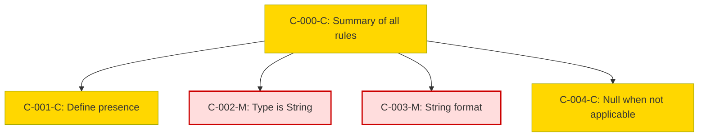

### Static Conformance Requirements – Availability Zone

| SCRItem                     | Function                  | Reference          | PreCondition                | Condition                                                   | Requirement               | Validation Criteria                                                                                               | Notes                                                                                         | VersionIntroduced | Status  |
|----------------------------|---------------------------|--------------------|-----------------------------|-------------------------------------------------------------|---------------------------|-------------------------------------------------------------------------------------------------------------------|-----------------------------------------------------------------------------------------------|-------------------|---------|
| AVAILABILITYZONE-C-000-C   | Summary of all rules      | Availability Zone  | SUPPORTS_AVAILABILITY_ZONE | null                                                        | AND of C-001 to C-004     | MUST satisfy all applicable conformance rules from C-001 to C-004                                                | Precondition: Rule applies only when SUPPORTS_AVAILABILITY_ZONE is true                      | 0.5               | active  |
| AVAILABILITYZONE-C-001-C   | Define presence           | Availability Zone  | SUPPORTS_AVAILABILITY_ZONE | null                                                        | null                      | AvailabilityZone is RECOMMENDED to be present when the provider supports deploying in an availability zone       | Precondition: SUPPORTS_AVAILABILITY_ZONE                                                     | 0.5               | active  |
| AVAILABILITYZONE-C-002-M   | Specify data type         | Availability Zone  | null                        | null                                                        | null                      | AvailabilityZone MUST be of type String                                                                           |                                                                                               | 0.5               | active  |
| AVAILABILITYZONE-C-003-M   | Ensure string formatting  | Availability Zone  | null                        | null                                                        | null                      | AvailabilityZone MUST conform to StringHandling requirements                                                      |                                                                                               | 0.5               | active  |
| AVAILABILITYZONE-C-004-C   | Null when not applicable  | Availability Zone  | null                        | Charge is not specific to an availability zone              | null                      | AvailabilityZone MUST be null when a charge is not specific to an availability zone                              |                                                                                               | 0.5               | active  |

### DAG of Static Conformance Requirements for `Availability Zone`

This diagram shows the logical structure and composite dependencies for the SCRs of the `Availability Zone` column in FOCUS v1.2.

| Color      | Rule Type     |
|------------|----------------|
| 🔴 `#fdd`   | Mandatory (M)  |
| 🟡 `#ffd700`| Conditional (C)|
| 🟢 `#c0f5c0`| Optional (O)   |